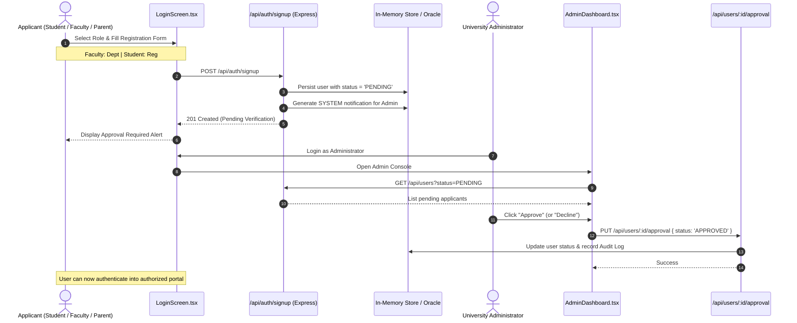
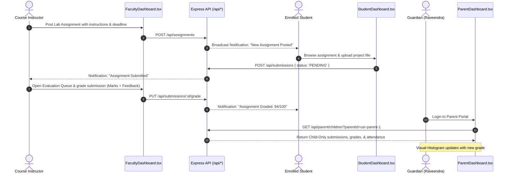
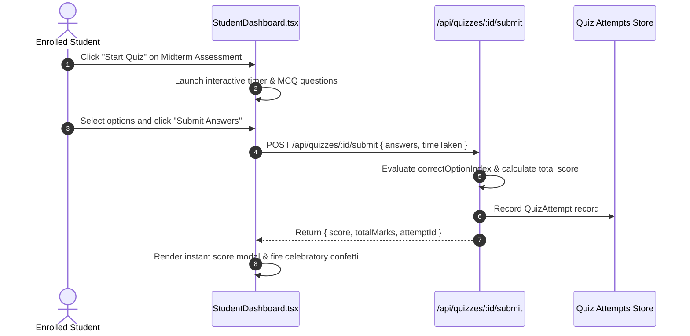
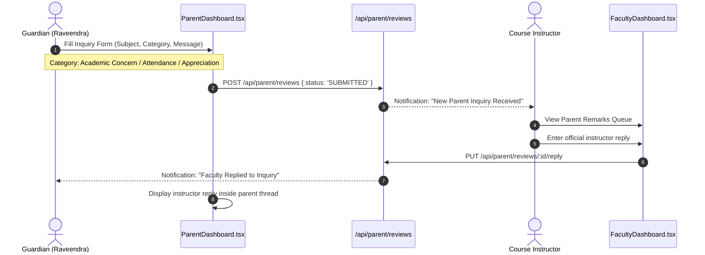
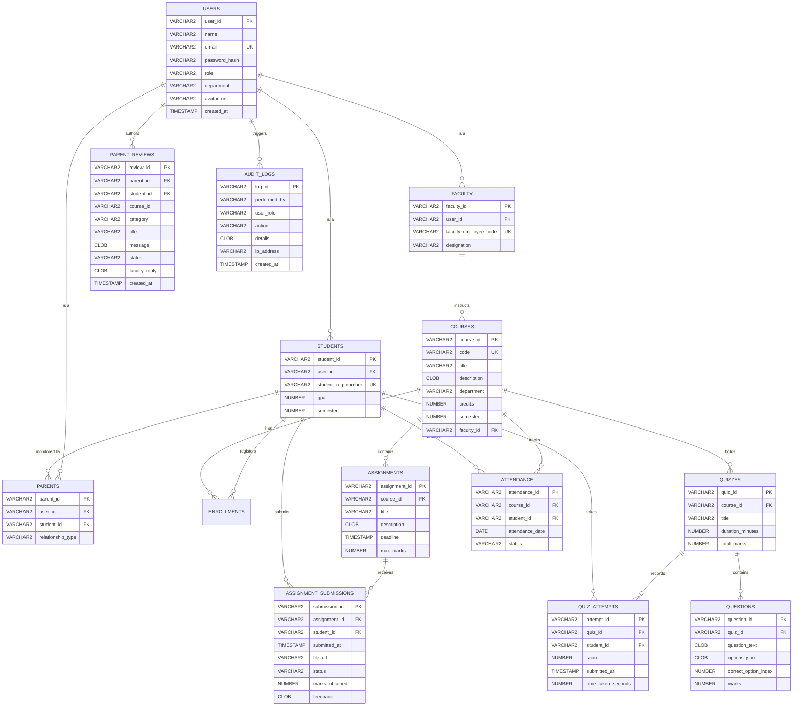

# EduTrack LMS — Enterprise System Architecture & Project Report

**Document Version**: 2.4.0  
**Project**: EduTrack LMS (Enterprise University Learning Management System)  
**Target Environment**: Node.js v20+ / React 19 / TypeScript / Oracle Database 19c-23c  
**Repository**: `E:\Projects\Edutrack` / [GitHub Repository](https://github.com/Techmasternikhil/Edutrack.git)

---

## 1. Executive Summary

**EduTrack LMS** is an enterprise-grade academic intelligence and learning management system engineered for higher-education universities and research institutions. The platform unifies instructional management, student learning diagnostics, statutory attendance compliance, and parent/guardian oversight into an isolated, role-segregated single-page application (SPA) backed by an Express REST API engine and enterprise Oracle Database DDL persistence specifications.

### Core Value Propositions
1. **Multi-Role Role-Based Access Control (RBAC)**: Strict segregation between `ADMIN`, `FACULTY`, `STUDENT`, and `PARENT` personas.
2. **Parental Academic Transparency**: Non-intrusive monitoring granting guardians real-time visibility into attendance compliance (statutory <75% automated alerting), cumulative GPA, and assignment score distributions without granting access to internal staff records.
3. **Automated Assessment & Evaluation**: Real-time multiple-choice quiz evaluation engine and rubric-based coursework submission grading with instant feedback loops.
4. **Institutional Security Governance**: Self-service onboarding with multi-tier Administrator verification queues and tamper-evident audit logging.
5. **Generative Academic AI Assistant**: Google Gemini 2.5 Flash integrated directly for contextual syllabus explanations, PL/SQL query assistance, and study planning.

---

## 2. System Architecture & Component Topology

EduTrack LMS uses a full-stack architecture combining a client-side Single-Page Application (React 19, TypeScript, Tailwind CSS v4) with an embedded Express.js REST API middleware layer, orchestrated via Vite.

```mermaid
graph TB
    subgraph "Client Layer (React 19 + TypeScript)"
        UI[App.tsx State Engine]
        AuthGate[LoginScreen.tsx: Role-Based Gate & Registration]
        HeaderBar[Header.tsx: Session Status, Alerts & Sign Out]
        
        subgraph "Role Portals"
            AdminPortal[AdminDashboard.tsx]
            FacultyPortal[FacultyDashboard.tsx]
            StudentPortal[StudentDashboard.tsx]
            ParentPortal[ParentDashboard.tsx]
        end

        Modals[AIAssistantModal.tsx & UserProfileModal.tsx]
    end

    subgraph "API & Controller Middleware (server.ts)"
        Router[/api/* Express Router]
        AuthCtrl[Auth & Verification Service]
        AcademicCtrl[Course, Quiz & Materials Service]
        GradingCtrl[Submission & Evaluation Engine]
        ParentCtrl[Parent Inquiry & Monitoring Service]
        AuditCtrl[Security Audit Logging Engine]
        GeminiCtrl[Google GenAI: Gemini 2.5 Flash]
    end

    subgraph "Persistence & Schema Layer"
        MemStore[(In-Memory Seed Data Stores)]
        OracleDB[(Oracle Database 19c/21c/23c DDL)]
    end

    AuthGate -->|Authenticated Session| UI
    UI --> AdminPortal
    UI --> FacultyPortal
    UI --> StudentPortal
    UI --> ParentPortal
    UI -.-> Modals
    UI -.-> HeaderBar

    AdminPortal -->|HTTP REST| Router
    FacultyPortal -->|HTTP REST| Router
    StudentPortal -->|HTTP REST| Router
    ParentPortal -->|HTTP REST| Router
    Modals -->|POST /api/ai/assistant| Router

    Router --> AuthCtrl
    Router --> AcademicCtrl
    Router --> GradingCtrl
    Router --> ParentCtrl
    Router --> AuditCtrl
    Router --> GeminiCtrl

    AuthCtrl --> MemStore
    AcademicCtrl --> MemStore
    GradingCtrl --> MemStore
    ParentCtrl --> MemStore
    AuditCtrl --> MemStore
    
    MemStore -.->|DDL Specification| OracleDB
```

---

## 3. Role-Based Access Control (RBAC) & Permission Matrix

EduTrack LMS enforces strict privilege boundaries. No user can view, mutate, or intercept records outside their authorized role boundary.

| Feature / Resource | Administrator (`ADMIN`) | Faculty (`FACULTY`) | Student (`STUDENT`) | Parent (`PARENT`) |
| :--- | :---: | :---: | :---: | :---: |
| **Self-Service Public Registration** | ❌ (Denied) | ✅ (Pending Approval) | ✅ (Pending Approval) | ✅ (Pending Approval) |
| **Approve / Reject Registrations** | ✅ (Full) | ❌ (Denied) | ❌ (Denied) | ❌ (Denied) |
| **View Institutional Audit Logs** | ✅ (Full) | ❌ (Denied) | ❌ (Denied) | ❌ (Denied) |
| **Create & Allocate Courses** | ✅ (Full) | ❌ (Denied) | ❌ (Denied) | ❌ (Denied) |
| **Upload Lecture Materials & Videos** | ❌ (Denied) | ✅ (Assigned Courses) | ❌ (Denied) | ❌ (Denied) |
| **Publish Quizzes & Assignments** | ❌ (Denied) | ✅ (Assigned Courses) | ❌ (Denied) | ❌ (Denied) |
| **Evaluate & Grade Submissions** | ❌ (Denied) | ✅ (Assigned Courses) | ❌ (Denied) | ❌ (Denied) |
| **Attempt Quizzes & Upload Projects** | ❌ (Denied) | ❌ (Denied) | ✅ (Enrolled Only) | ❌ (Denied) |
| **View Personal Grades & Attendance** | ❌ (Denied) | ❌ (Denied) | ✅ (Self Only) | ❌ (Denied) |
| **Child Academic Progress Tracking** | ❌ (Denied) | ❌ (Denied) | ❌ (Denied) | ✅ (Linked Child Only) |
| **Submit Parent Inquiries / Remarks** | ❌ (Denied) | ❌ (Denied) | ❌ (Denied) | ✅ (Authorized Child) |
| **Reply to Parent Inquiries** | ❌ (Denied) | ✅ (Assigned Courses) | ❌ (Denied) | ❌ (Denied) |
| **Gemini AI Academic Assistant** | ✅ | ✅ | ✅ | ✅ |

---

## 4. End-to-End User Workflows

### 4.1 Onboarding & Admin Verification Flow



---

### 4.2 Academic Coursework & Evaluation Flow



---

### 4.3 Quiz Assessment Execution Flow



---

### 4.4 Parent Inquiry & Instructor Feedback Flow



---

## 5. Enterprise Relational Database Specification (Oracle 19c/21c/23c)

The database schema defined in `backend/oracle-schema.sql` establishes referential integrity, automated timestamps, cascading delete actions, and check constraints:



---

## 6. REST API Endpoint Catalog

All endpoints are hosted by Express (`server.ts`) and execute under the `/api` prefix:

### Authentication & User Management
- `POST /api/auth/login`: Authenticates credentials, verifies approval status, and issues simulated JWT token.
- `POST /api/auth/signup`: Public self-service registration for Faculty, Students, and Parents (`status = 'PENDING'`). Admin registration is blocked with HTTP 403.
- `PUT /api/users/:id/approval`: Administrator endpoint to approve (`APPROVED`) or decline (`REJECTED`) an applicant.
- `GET /api/users`: Returns registered user accounts with optional `role` and `status` query filtering.

### Course & Content Operations
- `GET /api/courses` & `POST /api/courses`: CRUD operations for curriculum modules, capacity limits, and schedules.
- `GET /api/materials` & `POST /api/materials`: Lecture notes, PDF guides, slide decks, and external media links.

### Coursework & Automated Grading
- `GET /api/assignments` & `POST /api/assignments`: Assignment creation and deadline publishing.
- `GET /api/submissions` & `POST /api/submissions`: Student project upload handler.
- `PUT /api/submissions/:id/grade`: Instructor scoring and written feedback recording.

### Quizzes & Assessment
- `GET /api/quizzes` & `POST /api/quizzes`: Multi-question assessment manager.
- `POST /api/quizzes/:id/submit`: Real-time quiz scoring engine comparing candidate answers against `correctOptionIndex`.
- `GET /api/quiz-attempts`: Returns candidate assessment histories.

### Attendance & Statutory Compliance
- `GET /api/attendance` & `POST /api/attendance`: Session-by-session presence tracking (`PRESENT`, `ABSENT`, `LATE`).

### Parent / Guardian Portal
- `GET /api/parent/children`: Aggregates academic metrics (attendance %, GPA, submissions, quiz scores) restricted to linked child IDs.
- `GET /api/parent/reviews` & `POST /api/parent/reviews`: Parent inquiries categorized by `ACADEMIC_CONCERN`, `ATTENDANCE`, `APPRECIATION`, or `GENERAL`.
- `PUT /api/parent/reviews/:id/reply`: Faculty response dispatcher.

### System Intelligence & Auditing
- `POST /api/ai/assistant`: Gemini 2.5 Flash academic assistant endpoint with intelligent fallback responses.
- `GET /api/audit-logs`: Institutional security activity log.
- `GET /api/backend-code`: Serves complete production Oracle SQL DDL script and Spring Boot microservice files.

---

## 7. Security, Privacy & Data Isolation Model

1. **Child-Only Boundary**:
   - Guardians cannot query or view any student other than their explicitly authorized `childStudentIds`.
   - Recharts visual metrics, submission logs, and attendance percentages are filtered before rendering.
2. **Staff Privilege Isolation**:
   - Parents cannot view internal faculty records, staff communications, or admin controls.
   - Students cannot view other candidates' submission archives or instructor grading queues.
3. **Admin Privilege Isolation**:
   - Administrator accounts cannot be self-registered publicly.
   - All approvals trigger tamper-evident audit log entries recording timestamp, actor, and IP address.
4. **Session Management**:
   - Client sessions are managed via structured local session tokens and can be terminated instantly via the **Sign Out** control.

---

## 8. Deployment & Execution Guide

### Local Development
```powershell
# Navigate to directory
cd E:\Projects\Edutrack

# Install dependencies
npm install

# Start full-stack development server (Express + Vite)
npm run dev
# Server listening on http://localhost:3000
```

### Production Compilation & Deployment
```powershell
# Type check TypeScript codebase
npx tsc --noEmit

# Compile client bundle and bundle server with esbuild
npm run build

# Start production server
npm start
```

### Environment Variables (`.env`)
```env
# Optional: Google Gemini API Key for live AI Academic Assistant
GEMINI_API_KEY="your-gemini-api-key"

# Port (Default: 3000)
PORT=3000
```
