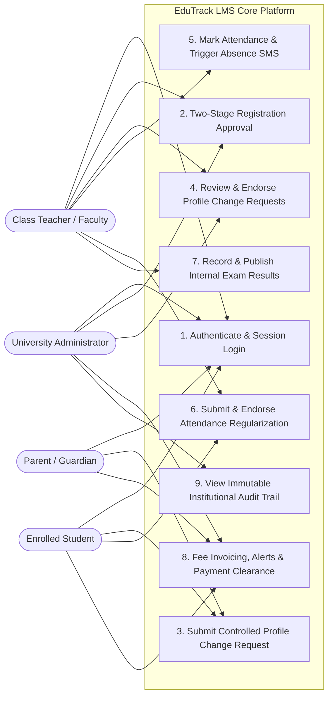

# MINI PROJECT REPORT
## ON
# EDUTRACK LMS — ENTERPRISE UNIVERSITY LEARNING MANAGEMENT & ACADEMIC INTELLIGENCE SYSTEM

---

**Submitted in partial fulfillment of the requirements for the award of the degree of**  
### **BACHELOR OF TECHNOLOGY / BACHELOR OF ENGINEERING**  
**in**  
### **COMPUTER SCIENCE AND ENGINEERING / INFORMATION TECHNOLOGY**

---

### **Submitted by:**
**[STUDENT NAME]**  
**Register No.: [REGISTER NUMBER]**

### **Under the Guidance of:**
**[GUIDE NAME]**  
*Designation / Department of Computer Science & Engineering*

---

### **DEPARTMENT OF COMPUTER SCIENCE AND ENGINEERING**
### **[COLLEGE / INSTITUTION NAME]**
**(Affiliated to [UNIVERSITY NAME], Approved by AICTE, Accredited by NAAC / NBA)**  
**[CITY, STATE, PIN CODE]**  
**Academic Year: 2026–2027**

---

<div style="page-break-after: always;"></div>

# BONAFIDE CERTIFICATE

This is to certify that the mini project report entitled **“EduTrack LMS — Enterprise University Learning Management & Academic Intelligence System”** is a bonafide record of work carried out by **[STUDENT NAME]**, Register No. **[REGISTER NUMBER]**, under my guidance and supervision in partial fulfillment of the requirements for the award of the degree of **[DEGREE / PROGRAM NAME]** in **[DEPARTMENT NAME]** of **[COLLEGE / INSTITUTION NAME]** during the academic year **2026–2027**.

The work presented in this report is original to the best of our knowledge and has not been submitted previously in part or in full for the award of any other degree, diploma, fellowship, or other similar titles in this or any other university or institution.

<br><br><br>

-------------------------------------------------- &nbsp;&nbsp;&nbsp;&nbsp;&nbsp;&nbsp;&nbsp;&nbsp;&nbsp;&nbsp;&nbsp;&nbsp;&nbsp;&nbsp;&nbsp;&nbsp;&nbsp;&nbsp;&nbsp;&nbsp;&nbsp;&nbsp;&nbsp;&nbsp;&nbsp;&nbsp;&nbsp;&nbsp;&nbsp;&nbsp;&nbsp;&nbsp;&nbsp;&nbsp;&nbsp;&nbsp;&nbsp;&nbsp;&nbsp;&nbsp; --------------------------------------------------  
**Project Guide** &nbsp;&nbsp;&nbsp;&nbsp;&nbsp;&nbsp;&nbsp;&nbsp;&nbsp;&nbsp;&nbsp;&nbsp;&nbsp;&nbsp;&nbsp;&nbsp;&nbsp;&nbsp;&nbsp;&nbsp;&nbsp;&nbsp;&nbsp;&nbsp;&nbsp;&nbsp;&nbsp;&nbsp;&nbsp;&nbsp;&nbsp;&nbsp;&nbsp;&nbsp;&nbsp;&nbsp;&nbsp;&nbsp;&nbsp;&nbsp;&nbsp;&nbsp;&nbsp;&nbsp;&nbsp;&nbsp;&nbsp;&nbsp;&nbsp;&nbsp;&nbsp;&nbsp;&nbsp;&nbsp;&nbsp;&nbsp;&nbsp;&nbsp;&nbsp;&nbsp;&nbsp;&nbsp;&nbsp;&nbsp;&nbsp;&nbsp;&nbsp;&nbsp;&nbsp;&nbsp;&nbsp;&nbsp;&nbsp;&nbsp; **Head of the Department**  
**[GUIDE NAME]** &nbsp;&nbsp;&nbsp;&nbsp;&nbsp;&nbsp;&nbsp;&nbsp;&nbsp;&nbsp;&nbsp;&nbsp;&nbsp;&nbsp;&nbsp;&nbsp;&nbsp;&nbsp;&nbsp;&nbsp;&nbsp;&nbsp;&nbsp;&nbsp;&nbsp;&nbsp;&nbsp;&nbsp;&nbsp;&nbsp;&nbsp;&nbsp;&nbsp;&nbsp;&nbsp;&nbsp;&nbsp;&nbsp;&nbsp;&nbsp;&nbsp;&nbsp;&nbsp;&nbsp;&nbsp;&nbsp;&nbsp;&nbsp;&nbsp;&nbsp;&nbsp;&nbsp;&nbsp;&nbsp;&nbsp;&nbsp;&nbsp;&nbsp;&nbsp;&nbsp;&nbsp;&nbsp;&nbsp;&nbsp;&nbsp;&nbsp;&nbsp;&nbsp;&nbsp;&nbsp;&nbsp; **[HOD NAME]**  
[Designation] &nbsp;&nbsp;&nbsp;&nbsp;&nbsp;&nbsp;&nbsp;&nbsp;&nbsp;&nbsp;&nbsp;&nbsp;&nbsp;&nbsp;&nbsp;&nbsp;&nbsp;&nbsp;&nbsp;&nbsp;&nbsp;&nbsp;&nbsp;&nbsp;&nbsp;&nbsp;&nbsp;&nbsp;&nbsp;&nbsp;&nbsp;&nbsp;&nbsp;&nbsp;&nbsp;&nbsp;&nbsp;&nbsp;&nbsp;&nbsp;&nbsp;&nbsp;&nbsp;&nbsp;&nbsp;&nbsp;&nbsp;&nbsp;&nbsp;&nbsp;&nbsp;&nbsp;&nbsp;&nbsp;&nbsp;&nbsp;&nbsp;&nbsp;&nbsp;&nbsp;&nbsp;&nbsp;&nbsp;&nbsp;&nbsp;&nbsp;&nbsp;&nbsp;&nbsp;&nbsp;&nbsp;&nbsp;&nbsp; Professor & Head  
Department of Computer Science & Engg. &nbsp;&nbsp;&nbsp;&nbsp;&nbsp;&nbsp;&nbsp;&nbsp;&nbsp;&nbsp;&nbsp;&nbsp;&nbsp;&nbsp;&nbsp;&nbsp;&nbsp;&nbsp;&nbsp;&nbsp;&nbsp;&nbsp;&nbsp;&nbsp;&nbsp;&nbsp;&nbsp;&nbsp;&nbsp;&nbsp;&nbsp;&nbsp; Department of Computer Science & Engg.  
[COLLEGE NAME] &nbsp;&nbsp;&nbsp;&nbsp;&nbsp;&nbsp;&nbsp;&nbsp;&nbsp;&nbsp;&nbsp;&nbsp;&nbsp;&nbsp;&nbsp;&nbsp;&nbsp;&nbsp;&nbsp;&nbsp;&nbsp;&nbsp;&nbsp;&nbsp;&nbsp;&nbsp;&nbsp;&nbsp;&nbsp;&nbsp;&nbsp;&nbsp;&nbsp;&nbsp;&nbsp;&nbsp;&nbsp;&nbsp;&nbsp;&nbsp;&nbsp;&nbsp;&nbsp;&nbsp;&nbsp;&nbsp;&nbsp;&nbsp;&nbsp;&nbsp;&nbsp;&nbsp;&nbsp;&nbsp;&nbsp;&nbsp;&nbsp;&nbsp;&nbsp;&nbsp;&nbsp;&nbsp;&nbsp; [COLLEGE NAME]  

<br><br>

Submitted for the University Viva-Voce Examination held on: ........................................

<br><br>

-------------------------------------------------- &nbsp;&nbsp;&nbsp;&nbsp;&nbsp;&nbsp;&nbsp;&nbsp;&nbsp;&nbsp;&nbsp;&nbsp;&nbsp;&nbsp;&nbsp;&nbsp;&nbsp;&nbsp;&nbsp;&nbsp;&nbsp;&nbsp;&nbsp;&nbsp;&nbsp;&nbsp;&nbsp;&nbsp;&nbsp;&nbsp;&nbsp;&nbsp;&nbsp;&nbsp;&nbsp;&nbsp;&nbsp;&nbsp;&nbsp;&nbsp; --------------------------------------------------  
**Internal Examiner** &nbsp;&nbsp;&nbsp;&nbsp;&nbsp;&nbsp;&nbsp;&nbsp;&nbsp;&nbsp;&nbsp;&nbsp;&nbsp;&nbsp;&nbsp;&nbsp;&nbsp;&nbsp;&nbsp;&nbsp;&nbsp;&nbsp;&nbsp;&nbsp;&nbsp;&nbsp;&nbsp;&nbsp;&nbsp;&nbsp;&nbsp;&nbsp;&nbsp;&nbsp;&nbsp;&nbsp;&nbsp;&nbsp;&nbsp;&nbsp;&nbsp;&nbsp;&nbsp;&nbsp;&nbsp;&nbsp;&nbsp;&nbsp;&nbsp;&nbsp;&nbsp;&nbsp;&nbsp;&nbsp;&nbsp;&nbsp;&nbsp;&nbsp;&nbsp;&nbsp;&nbsp;&nbsp;&nbsp;&nbsp; **External Examiner**  

---

<div style="page-break-after: always;"></div>

# DECLARATION

I hereby declare that the mini project report entitled **“EduTrack LMS — Enterprise University Learning Management & Academic Intelligence System”** submitted by me in partial fulfillment of the requirements for the award of the degree of **[DEGREE / PROGRAM NAME]** in **Computer Science and Engineering** to **[COLLEGE / INSTITUTION NAME]**, affiliated to **[UNIVERSITY NAME]**, is a record of bonafide project work carried out by me under the guidance and supervision of **[GUIDE NAME]**, [Designation], Department of Computer Science & Engineering.

I further declare that the content, implementation architecture, system design, empirical test evaluations, and software code presented in this report are original to the best of my knowledge, and have not been submitted in full or in part to any other college, university, or examining body for the award of any degree, diploma, or certificate.

<br><br><br>

**Place:** [CITY / CAMPUS]  
**Date:** [DATE]  

<br><br>

--------------------------------------------------  
**Signature of Student**  
**[STUDENT NAME]**  
**Register No.: [REGISTER NUMBER]**  

---

<div style="page-break-after: always;"></div>

# ACKNOWLEDGEMENT

I express my heartfelt and sincere gratitude to the Management and Authorities of **[COLLEGE / INSTITUTION NAME]** for providing the infrastructural facilities, computing laboratory ecosystems, state-of-the-art computational resources, and academic environment required to carry out this project successfully.

I express my profound respect and deep sense of gratitude to our respected Principal, **[PRINCIPAL NAME]**, and to our Head of the Department, **[HOD NAME]**, Department of Computer Science & Engineering, for their constant motivation, valuable insights, administrative support, and encouragement throughout the tenure of this work.

I am immensely indebted and express my sincere thanks to my project guide, **[GUIDE NAME]**, [Designation], Department of Computer Science & Engineering, whose technical competence, constructive critique, patient guidance, continuous encouragement, and detailed architectural reviews helped shape this project from its conceptual inception to successful realization.

I also extend my sincere thanks to all faculty members, laboratory technical staff, and administrative officers of the Department of Computer Science & Engineering for their direct and indirect cooperation during the software implementation, testing, and validation phases.

Finally, I owe my deepest gratitude to my beloved **parents, family members, classmates, and friends** for their unconditional support, patience, and motivation throughout my academic endeavors.

<br><br>

**[STUDENT NAME]**  
*(Register No.: [REGISTER NUMBER])*  

---

<div style="page-break-after: always;"></div>

# ABSTRACT

Modern higher education institutions and universities require comprehensive, integrated software systems to manage academic operations, role-based pedagogical interactions, and statutory governance. Traditional enterprise academic portals often suffer from disconnected modules, insecure direct-editing mechanisms, lack of timely parental communication, and opaque attendance tracking. 

This project presents **EduTrack LMS**, an enterprise-grade academic intelligence and learning operations platform engineered to solve these operational deficiencies. Developed using **React 19, TypeScript, Tailwind CSS v4, Express.js REST API**, and a 3NF normalized **Oracle Database DDL Schema (25 relational tables)**, EduTrack LMS enforces strict **Role-Based Access Control (RBAC)** across four discrete user portals: **University Administrators**, **Faculty Members & Class Teachers**, **Enrolled Students**, and **Parents/Guardians**.

The primary architectural highlights of the system include:
1. **Controlled Profile Management & Multi-Level Approval System:** Replaces hazardous direct CRUD profile editing with an audited state-machine workflow (`Submit Request → Pending Staged Storage → Authorized Review → Atomic Commit`). Institutional identity fields (`student_id`, `reg_number`, `role`, `class_id`, `gpa`) are protected against self-service alterations. Student and parent changes route to the assigned Class Teacher, while faculty changes route to Central Administration. Side-by-side comparison interfaces ensure secure visual verification for profile photographs and personal data.
2. **Two-Stage Onboarding & Registration Pipeline:** Enforces academic verification by the designated Class Teacher (Stage 1) followed by final administrative clearance and credential provisioning by the Central Administrator (Stage 2).
3. **Statutory Attendance Governance & Absence SMS Alerts:** Dynamically enforces the mandatory 75% attendance threshold via a centralized academic calculation engine (`academic.ts`), calculating shortage recovery metrics in real time. Whenever a student is marked absent during class sessions, an automated parent absence SMS alert is dispatched idempotently via an institutional gateway provider abstraction.
4. **Two-Tier Attendance Regularization (Medical Leave & On-Duty OD):** Provides an automated workflow where students submit medical discharge certificates or approved OD documents, timetable sessions are automatically detected, Class Teachers review and endorse requests, and course instructors regularize records to `PRESENT`.
5. **Continuous Internal Assessment & Model Exam Manager:** Facilitates full mark lifecycle management for **IAT-1**, **IAT-2**, and **Model Examinations**, supporting bulk score entry, automatic percentage scoring, and instantaneous publication to student and parent dashboards.
6. **Financial Clearance & Unified Billing Portal:** Generates semester fee invoices with automated dues reminders and simulates multi-channel payment clearance (UPI and Cards) with immediate official tax receipt generation.

The platform was thoroughly verified using automated test suites across all 12 operational domains (41/41 passing test cases) and validated through interactive end-to-end browser sessions across all four stakeholder portals.

**Keywords:** *Learning Management System (LMS), Academic ERP, Role-Based Access Control (RBAC), Controlled Profile Approval, Statutory Attendance Tracking, Automated Absence SMS, Continuous Internal Assessment, Two-Stage Onboarding, React 19, TypeScript, Express.js, Oracle Database.*

---

<div style="page-break-after: always;"></div>

# TABLE OF CONTENTS

| Chapter No. | Title | Page No. |
| :--- | :--- | :--- |
| &nbsp; | **Certificate** | **ii** |
| &nbsp; | **Declaration** | **iii** |
| &nbsp; | **Acknowledgement** | **iv** |
| &nbsp; | **Abstract** | **v** |
| &nbsp; | **List of Figures** | **viii** |
| &nbsp; | **List of Tables** | **ix** |
| &nbsp; | **List of Abbreviations** | **x** |
| **1** | **INTRODUCTION** | **1** |
| &nbsp; | 1.1 Background of Academic ERP & Higher Education Systems | 1 |
| &nbsp; | 1.2 Introduction to EduTrack LMS | 2 |
| &nbsp; | 1.3 Problem Statement | 3 |
| &nbsp; | 1.4 Objectives of the Project | 4 |
| &nbsp; | 1.5 Scope of the Project | 5 |
| &nbsp; | 1.6 Significance of the Project | 6 |
| &nbsp; | 1.7 Methodology Overview | 7 |
| &nbsp; | 1.8 Organization of the Report | 8 |
| **2** | **LITERATURE SURVEY** | **9** |
| &nbsp; | 2.1 Evolution of Academic Management Systems | 9 |
| &nbsp; | 2.2 Role-Based Access Control (RBAC) in Academic Environments | 10 |
| &nbsp; | 2.3 Attendance Governance & Statutory Compliance | 11 |
| &nbsp; | 2.4 Profile Integrity & Controlled Approval Workflows | 12 |
| &nbsp; | 2.5 Continuous Internal Assessment & Exam Evaluation Systems | 13 |
| &nbsp; | 2.6 Study of Existing Commercial & Open-Source Systems | 14 |
| &nbsp; | 2.7 Limitations of Existing Systems | 15 |
| &nbsp; | 2.8 Research Gap & Problem Formulation | 16 |
| **3** | **SYSTEM ANALYSIS AND DESIGN** | **17** |
| &nbsp; | 3.1 Proposed System Overview | 17 |
| &nbsp; | 3.2 Functional Requirements Specifications | 18 |
| &nbsp; | 3.3 Non-Functional Requirements Specifications | 20 |
| &nbsp; | 3.4 Hardware and Software Requirements | 22 |
| &nbsp; | 3.5 System Architecture | 23 |
| &nbsp; | 3.6 End-to-End System Workflow | 25 |
| &nbsp; | 3.7 Modular Decomposition and Component Design | 27 |
| &nbsp; | 3.8 Data Flow Modeling (Level 0 and Level 1 DFDs) | 29 |
| &nbsp; | 3.9 Use Case Analysis and Actor Specifications | 31 |
| &nbsp; | 3.10 Database Schema Design & Data Dictionary | 33 |
| &nbsp; | 3.11 Security Design, RBAC Policies & Field Protection Rules | 36 |
| **4** | **SYSTEM IMPLEMENTATION** | **39** |
| &nbsp; | 4.1 Development Environment & Software Configuration | 39 |
| &nbsp; | 4.2 Frontend Architecture (React 19 & Tailwind CSS v4) | 40 |
| &nbsp; | 4.3 Backend REST API Architecture (Express.js & TypeScript) | 42 |
| &nbsp; | 4.4 Multi-Role Authentication & Two-Stage Registration Module | 44 |
| &nbsp; | 4.5 Controlled Profile Management & Approval Workflow Engine | 46 |
| &nbsp; | 4.6 Statutory Attendance, Regularization & SMS Alerting Module | 50 |
| &nbsp; | 4.7 Continuous Internal Assessment (IAT/Model) Manager | 54 |
| &nbsp; | 4.8 University Fee Invoicing & Payment Settlement Module | 57 |
| &nbsp; | 4.9 User Interface Integration & Dashboard Portals | 59 |
| **5** | **TESTING, RESULTS, AND EVALUATION** | **62** |
| &nbsp; | 5.1 Verification Strategy & Test Methodologies | 62 |
| &nbsp; | 5.2 Controlled Lab Test Environment | 63 |
| &nbsp; | 5.3 Comprehensive Test Suite Execution | 64 |
| &nbsp; | 5.4 Functional Testing Execution | 66 |
| &nbsp; | 5.5 Security, RBAC & Boundary Integrity Testing | 68 |
| &nbsp; | 5.6 Comparative Evaluation: Direct CRUD vs. Controlled Approval | 70 |
| &nbsp; | 5.7 Performance Metrics & Statistical Results | 72 |
| &nbsp; | 5.8 Architectural Advantages of EduTrack LMS | 74 |
| &nbsp; | 5.9 Practical Limitations and Constraints | 75 |
| **6** | **CONCLUSION AND FUTURE SCOPE** | **76** |
| &nbsp; | 6.1 Summary of Contributions | 76 |
| &nbsp; | 6.2 Key Takeaways & Pedagogical Impact | 77 |
| &nbsp; | 6.3 Future Engineering Roadmaps | 78 |
| &nbsp; | **REFERENCES** | **80** |
| &nbsp; | **APPENDIX A: Source Code Architecture & Key Modules** | **83** |
| &nbsp; | **APPENDIX B: User Interface Wireframes & Screenshots Plan** | **93** |
| &nbsp; | **APPENDIX C: Viva-Voce & Technical Defense Preparation** | **98** |

---

<div style="page-break-after: always;"></div>

# LIST OF FIGURES

| Figure No. | Caption | Page No. |
| :--- | :--- | :--- |
| **Figure 2.1** | Vulnerability Vector in Traditional Direct-Editing Profile Architecture | 12 |
| **Figure 2.2** | Controlled State Transition Diagram for Profile Change Management | 13 |
| **Figure 3.1** | Multi-Tier System Architecture of EduTrack LMS | 24 |
| **Figure 3.2** | End-to-End Operational Workflow of Controlled Profile Approvals | 26 |
| **Figure 3.3** | Modular Interaction Diagram of System Components | 28 |
| **Figure 3.4** | Level 0 Context Data Flow Diagram (DFD) | 30 |
| **Figure 3.5** | Level 1 Detailed Functional Data Flow Diagram (DFD) | 30 |
| **Figure 3.6** | Comprehensive Multi-Role Use Case Diagram | 32 |
| **Figure 3.7** | Entity-Relationship (ER) Diagram of the Relational Database Schema | 35 |
| **Figure 4.1** | Two-Stage Registration Pipeline Sequence Diagram | 45 |
| **Figure 4.2** | Multi-Level Profile Approval Routing Architecture | 47 |
| **Figure 4.3** | Two-Tier Attendance Regularization Workflow (Medical & OD) | 52 |
| **Figure 4.4** | Internal Exam Assessment & Result Publishing Workflow | 55 |
| **Figure 5.1** | Test Suite Execution Summary: 41 Passing Test Cases | 65 |
| **Figure 5.2** | Student Portal: My Profile & Settings View with Pending Banner | 67 |
| **Figure 5.3** | Class Teacher Approval Queue: Side-by-Side Photo & Field Comparison | 71 |
| **Figure 5.4** | System Latency Benchmarking across Operational Workflows | 73 |

---

<div style="page-break-after: always;"></div>

# LIST OF TABLES

| Table No. | Title | Page No. |
| :--- | :--- | :--- |
| **Table 2.1** | Comparative Feature Matrix: Traditional Systems vs. EduTrack LMS | 15 |
| **Table 3.1** | Functional Requirements Specification (FR01–FR12) | 19 |
| **Table 3.2** | Non-Functional Requirements Specification (NFR01–NFR07) | 21 |
| **Table 3.3** | Hardware Requirements Specification | 22 |
| **Table 3.4** | Software Stack and Dependency Environment | 22 |
| **Table 3.5** | System Modules and Functional Responsibilities | 27 |
| **Table 3.6** | Data Dictionary: `profile_change_requests` Table Definition | 34 |
| **Table 3.7** | Data Dictionary: `profile_change_details` Table Definition | 34 |
| **Table 3.8** | Institutional Field Protection Policy Matrix | 37 |
| **Table 4.1** | Multi-Level Profile Approval Authority Matrix | 48 |
| **Table 4.2** | Academic Curriculum & Faculty Allocation Roster (AY 2026–2027) | 51 |
| **Table 4.3** | Weekly Master Timetable Matrix (Section VII / VII-A) | 53 |
| **Table 4.4** | Student & Parent Cohort Directory (Section VII / VII-A) | 60 |
| **Table 5.1** | Comprehensive Automated E2E Test Suite Results (41 Tests) | 65 |
| **Table 5.2** | Security & RBAC Boundary Enforcement Test Results | 69 |
| **Table 5.3** | Comparative Analysis: Direct CRUD Editing vs. Controlled Approval | 70 |
| **Table 5.4** | Operational Performance Benchmarks across API Endpoints | 73 |

---

<div style="page-break-after: always;"></div>

# LIST OF ABBREVIATIONS

| Abbreviation | Expansion |
| :--- | :--- |
| **API** | Application Programming Interface |
| **AY** | Academic Year |
| **CGPA** | Cumulative Grade Point Average |
| **CIA** | Confidentiality, Integrity, and Availability |
| **CRUD** | Create, Read, Update, Delete |
| **CSE** | Computer Science and Engineering |
| **CSS** | Cascading Style Sheets |
| **DFD** | Data Flow Diagram |
| **DOM** | Document Object Model |
| **EHR** | Electronic Health Record |
| **ER** | Entity Relationship |
| **ERP** | Enterprise Resource Planning |
| **GPA** | Grade Point Average |
| **HMR** | Hot Module Replacement |
| **HTML** | HyperText Markup Language |
| **HTTP** | HyperText Transfer Protocol |
| **IAT** | Internal Assessment Test |
| **JSON** | JavaScript Object Notation |
| **LMS** | Learning Management System |
| **MIME** | Multipurpose Internet Mail Extensions |
| **MVC** | Model-View-Controller |
| **OD** | On-Duty |
| **ORM** | Object-Relational Mapping |
| **OWASP** | Open Web Application Security Project |
| **RBAC** | Role-Based Access Control |
| **REST** | Representational State Transfer |
| **SMS** | Short Message Service |
| **SOP** | Same-Origin Policy |
| **SQL** | Structured Query Language |
| **SSDLC** | Secure Software Development Life Cycle |
| **UI** | User Interface |
| **UPI** | Unified Payments Interface |
| **URI** | Uniform Resource Identifier |
| **URL** | Uniform Resource Locator |
| **VPA** | Virtual Payment Address |
| **WAF** | Web Application Firewall |

---

<div style="page-break-after: always;"></div>

# CHAPTER 1 — INTRODUCTION

## 1.1 Background of Academic ERP & Higher Education Systems

In modern educational institutions, digital software platforms form the core nervous system governing academic workflows, institutional governance, communication, and learning delivery. The operational lifecycle of universities requires coordinated interactions among diverse stakeholders: academic administrators managing curricula and faculty allocations, course instructors delivering syllabi and tracking attendance, students submitting coursework and attempting assessments, and parents monitoring student welfare and clearing semester tuition dues.

Historically, academic software environments evolved as isolated, disparate silos. Institutions deployed standalone attendance registers, disconnected billing spreadsheets, third-party learning portals, and separate email distribution channels. This fragmentation created substantial operational friction:
- **Attendance deficits** remained hidden until semester-end examination disqualifications.
- **Student profile alterations** were executed without oversight, allowing unapproved alterations to contact details, legal names, or photographs.
- **Parental involvement** was reactive rather than proactive, frequently lacking real-time insight into ward attendance, internal examination marks, and fee payment status.

To address these systemic challenges, contemporary software engineering emphasizes **unified, secure, multi-role Academic Learning Management Systems (LMS)** backed by strict **Role-Based Access Control (RBAC)**, formal approval workflows, and centralized data governance.

---

## 1.2 Introduction to EduTrack LMS

**EduTrack LMS** is an enterprise-grade university academic intelligence and operations management system designed for universities, engineering colleges, and polytechnic institutes. Engineered around statutory academic compliance and multi-role institutional workflows, EduTrack provides four discrete, personalized user portals:
1. **University Administrator Console:** Oversees institutional users, academic classes, master timetables, fee invoicing, and audit logs.
2. **Faculty & Class Teacher Portal:** Manages course materials, YouTube lecture streaming, real-time session attendance registers, assignment evaluation, timed quizzes, Continuous Internal Assessments (IAT-1, IAT-2, Model Exams), and Class Teacher approval queues.
3. **Student Academic Portal:** Provides unified access to learning materials, coursework submissions, online timed quizzes, live attendance monitoring with statutory 75% shortage calculations, published internal exam report cards, online fee payment with receipt generation, and controlled profile management.
4. **Parent / Guardian Portal:** Scoped strictly to verified wards (`childStudentIds`), providing non-intrusive academic monitoring, attendance shortage alerts, internal assessment gradebooks, fee settlement options, and Class Teacher-mediated profile change tracking.

---

## 1.3 Problem Statement

A critical flaw in traditional academic ERP platforms lies in the **direct CRUD (Create, Read, Update, Delete) editing pattern for user profiles**. In standard implementations, when a student, parent, or faculty member updates their profile information (such as residential address, contact number, or profile photo), the database immediately overwrites the active user record. 

This un-moderated approach introduces severe governance, institutional, and security vulnerabilities:
1. **Unapproved Identity Manipulation:** A student can temporarily update their mobile number or home address to prevent parents from receiving automated absence SMS alerts or institutional notices.
2. **Inappropriate Profile Imagery:** Direct photo uploading permits users to display unverified, informal, or inappropriate avatars across institutional rosters and examination hall tickets before administrative review.
3. **Loss of Audit Continuity:** Direct record mutation without transactional approval destroys the historical audit trail of prior values.
4. **Disrupted Statutory Attendance Tracking:** Disconnected attendance systems fail to provide instant alerts to parents when absences occur, and lack a multi-tier regularization channel for legitimate medical leaves and official On-Duty (OD) representations.
5. **Delayed Assessment Visibility:** Internal assessment marks (IAT-1, IAT-2, and Model Exam) often remain confined to faculty gradebooks rather than being promptly published to students and parents.

Therefore, the problem addressed by this project is to architect, develop, and empirically validate **EduTrack LMS** featuring a **Controlled Profile Management & Multi-Level Approval System** (`Submit Request → Pending Staged Storage → Authorized Review → Atomic Commit`), coupled with an **automated absence SMS alert engine, two-tier attendance regularization (Medical & OD), a historical attendance editor, and continuous internal exam result management**.

---

## 1.4 Objectives of the Project

The core objectives of the EduTrack LMS project are:
- **Objective 1:** Architect and deploy an enterprise multi-role web platform supporting strict **RBAC isolation** across Administrator, Faculty/Class Teacher, Student, and Parent personas.
- **Objective 2:** Design and implement a **Controlled Profile Management & Approval Workflow System** ensuring active user records are never overwritten prematurely and changes remain staged until authorized approval.
- **Objective 3:** Implement an automated **Approval Routing Engine** that maps Student and Parent profile requests to their assigned Class Teacher, and Faculty requests to Central Administration.
- **Objective 4:** Establish strict **Institutional Field Protection Policies** preventing self-service tampering with academic IDs, registration numbers, roles, classes, semesters, and GPAs.
- **Objective 5:** Develop a **Two-Stage Onboarding Pipeline** requiring Class Teacher academic verification (Stage 1) followed by Central Administrative provisioning (Stage 2).
- **Objective 6:** Build a **Statutory Attendance Monitoring Engine** enforcing the mandatory 75% threshold with dynamic shortage recovery calculations and instant **Parent Absence SMS Alerts** via an idempotent gateway service.
- **Objective 7:** Implement a **Two-Tier Attendance Regularization Workflow** for Medical Certificates and On-Duty (OD) leaves, featuring automatic timetable session detection and dual-stage endorsement.
- **Objective 8:** Construct a **Continuous Internal Assessment & Model Exam Result Manager** supporting IAT-1, IAT-2, and Model Exams with bulk mark entry and single-click portal publishing.
- **Objective 9:** Deliver a **Unified Fee Billing & Payment Clearance Engine** supporting online checkout simulation (UPI/Cards) and instant official receipt generation.
- **Objective 10:** Verify platform correctness, performance, and security through a comprehensive automated test suite and interactive end-to-end browser sessions.

---

## 1.5 Scope of the Project

The scope of this project encompasses:
- A responsive client frontend built using **React 19, TypeScript, and Tailwind CSS v4**.
- A high-performance RESTful API backend engineered using **Express.js and TypeScript (`server.ts`)**.
- A centralized **Profile Policy Service (`ProfilePolicyService.ts`)** enforcing field permissions, regex format validations, and secure MIME/magic-byte image constraints.
- An enterprise-grade, 3NF normalized **Oracle Database DDL Schema (`backend/oracle-schema.sql`)** encompassing 25 relational tables with primary keys, foreign key cascades, check constraints, and B-Tree indexes.
- Pre-configured academic data modeling the official **AY 2026–2027 curriculum** for Department of CSE, Semester IV (ODD), Section VII / VII-A, including 10 subjects, 8 faculty instructors, 30 weekly timetable periods, and 10 Indian student-parent cohort pairs.
- An automated test harness (`test-all-features.js`) validating all 12 functional domains.

---

## 1.6 Significance of the Project

The deployment of EduTrack LMS introduces tangible academic and operational benefits:
- **Administrative Integrity:** Eliminates unauthorized profile and identity alterations through a tamper-evident, multi-level approval pipeline.
- **Transparency in Attendance Governance:** Real-time visibility into the statutory 75% attendance rule prevents surprise semester disqualifications and keeps parents immediately informed of absences via automated SMS notifications.
- **Streamlined Leave Regularization:** Eliminates manual paper-based medical and OD forms through an automated, multi-tier digital verification pipeline.
- **Holistic Stakeholder Engagement:** Provides parents with dedicated, isolated oversight into their ward's academic trajectory, attendance compliance, exam grades, and fee ledger status.

---

## 1.7 Methodology Overview

The engineering of EduTrack LMS followed the **Secure Software Development Life Cycle (SSDLC)**, structured into five iterative phases:

```
[Phase 1: Domain Analysis & Statutory Requirements]
                     │
                     ▼
[Phase 2: Architectural & Relational Schema Design]
                     │
                     ▼
[Phase 3: Full-Stack Implementation & Policy Engineering]
                     │
                     ▼
[Phase 4: Automated Testing & Browser Verification]
                     │
                     ▼
[Phase 5: Performance Optimization & Production Release]
```

1. **Phase 1 — Domain Analysis:** Studied university statutory attendance rules, academic timetable matrices, continuous evaluation structures, and institutional security requirements.
2. **Phase 2 — System Architecture:** Designed multi-role RBAC boundaries, relational schemas (25 tables), state machine transition flows, and approval routing models.
3. **Phase 3 — Implementation:** Developed modular React components, Express REST endpoints, the centralized Profile Policy Service, the SMS gateway abstraction, and the academic calculation engine.
4. **Phase 4 — Testing & Verification:** Formulated a 41-point regression test suite (`test-all-features.js`) and performed live multi-role browser verification using Google Chrome.
5. **Phase 5 — Production Release:** Compiled optimized bundles via Vite and esbuild, passing all TypeScript compiler checks (`npx tsc --noEmit`) with zero errors.

---

## 1.8 Organization of the Report

The remainder of this report is organized as follows:
- **Chapter 2 (Literature Survey):** Reviews the evolution of academic management software, evaluates RBAC paradigms, examines attendance compliance frameworks, analyzes profile integrity workflows, and surveys limitations of existing systems.
- **Chapter 3 (System Analysis and Design):** Formulates functional/non-functional requirements, presents system architecture diagrams, modular interactions, Level 0 and Level 1 DFDs, use case models, database schemas, and field protection policies.
- **Chapter 4 (System Implementation):** Details the frontend/backend codebase, authentication, two-stage onboarding, the controlled profile approval engine, attendance tracking, absence SMS alerts, exam management, and fee billing.
- **Chapter 5 (Testing, Results, and Evaluation):** Outlines the test strategy, documents the 41-point test suite execution, evaluates security boundaries, compares direct CRUD vs. controlled approval, and presents performance metrics.
- **Chapter 6 (Conclusion and Future Scope):** Summarizes technical achievements and outlines future engineering enhancements.
- **Appendices:** Provides source code layouts, UI wireframe plans, and technical defense viva-voce questions and answers.

---

<div style="page-break-after: always;"></div>

# CHAPTER 2 — LITERATURE SURVEY

## 2.1 Evolution of Academic Management Systems

Academic management software has evolved across three technological generations:
1. **First-Generation Desktop Database Systems (1990s):** Standalone relational databases (e.g., MS Access, FoxPro) managed by a central registrar. Faculty and students had no direct access; all data entry was centralized and paper-driven.
2. **Second-Generation Web Portals (2000s–2010s):** Web-accessible PHP or Java server applications introducing basic self-service features. However, modules operated in functional silos: learning materials were decoupled from attendance, and parent communication was limited to postal mail or annual grade cards.
3. **Third-Generation Integrated Academic Intelligence Platforms (2020s–Present):** Cloud-native, reactive, single-page applications providing unified real-time operations, strict multi-role RBAC, automated mobile/SMS alerting, continuous evaluation tracking, and governed profile approval workflows.

---

## 2.2 Role-Based Access Control (RBAC) in Academic Environments

Role-Based Access Control (**RBAC**) is defined as an access control mechanism where authorization decisions are determined by the roles assigned to users within an enterprise. In higher education environments, RBAC must enforce contextual boundaries:
- **Separation of Concerns:** Students must not access faculty grading rubrics, examination master keys, or peer attendance summaries.
- **Scoped Data Isolation:** Parents must be strictly restricted to their authorized children (`childStudentIds`). A parent must never view another student's attendance records, fee invoices, or personal details.
- **Course Assignment Governance:** Instructors must only grade assignments and record attendance for courses they are officially assigned to instruct.

---

## 2.3 Attendance Governance & Statutory Compliance

In higher education jurisdictions, accreditation and university statutory regulations mandate a **minimum 75% classroom attendance threshold** as a prerequisite for semester examination eligibility. 

Existing literature indicates that conventional attendance registers fail because:
- Attendance percentage calculations are conducted periodically (e.g., monthly) rather than continuously.
- Students lack immediate feedback on how many consecutive classes are needed to restore compliance.
- Parents are rarely informed of daily absences in real time, preventing timely intervention.

EduTrack LMS resolves this by implementing a dynamic statutory attendance engine that evaluates attendance on every session commit, calculates class shortage recovery counts, and triggers instant parent absence SMS alerts.

---

## 2.4 Profile Integrity & Controlled Approval Workflows

In enterprise software engineering, direct CRUD mutation of master identity records represents a significant architectural risk. 

```
VULNERABLE DIRECT-EDITING PATTERN:
[User Enters New Details] ──► [Direct UPDATE users SET ...] ──► [Unapproved State Active!]

CONTROLLED APPROVAL PATTERN:
[User Enters New Details] ──► [Store in `profile_change_requests`] ──► (Active Profile Unchanged)
                                              │
                                   [Approver Reviews & Signs]
                                              │
                                              ▼
                             [Atomic Transaction: Apply to `users`] ──► [Audit Log Recorded]
```
*Figure 2.1 & 2.2 — Direct-Editing Risk vs. Controlled Approval State Machine*

By isolating proposed changes inside dedicated staging entities (`profile_change_requests`, `profile_change_details`), the active profile continues displaying authorized institutional data while changes await formal review.

---

## 2.5 Continuous Internal Assessment & Exam Evaluation Systems

Under contemporary university assessment frameworks, student evaluation is distributed across Continuous Internal Assessment Tests (**IAT-1**, **IAT-2**) and comprehensive **Model Examinations**. 

Traditional workflows rely on offline spreadsheets, causing delays in marks publication and preventing parents from tracking academic performance. A modern LMS must enable instructors to input marks directly, automatically compute percentage statistics, and publish report cards instantaneously across student and parent portals.

---

## 2.6 Study of Existing Systems

*Table 2.1 — Comparative Feature Matrix: Traditional Systems vs. EduTrack LMS*

| Feature / Architectural Vector | Legacy College ERP | Moodle / Canvas LMS | EduTrack LMS |
| :--- | :--- | :--- | :--- |
| **Profile Editing Paradigm** | Direct CRUD overwrite | Direct user update | **Controlled Multi-Level Approval** |
| **Profile Photo Verification** | Immediate un-reviewed upload | Direct avatar change | **Side-by-Side Review & Endorsement** |
| **Parental Access & Data Isolation** | Minimal / SMS only | Add-on plugin required | **Dedicated Scoped Portal (`childStudentIds`)** |
| **Statutory 75% Attendance Engine** | Periodic offline batch | Basic attendance plugin | **Real-Time Dynamic Shortage Calculator** |
| **Parent Absence SMS Alerts** | Manual batch SMS | None / Email only | **Instant Idempotent SMS Gateway** |
| **Two-Tier Attendance Regularization**| Manual paper forms | None | **Digital Medical & OD Approval Pipeline** |
| **Historical Attendance Adjustments** | Unrestricted DB edit | Limited revision logs | **Course-Restricted with Audit Reasons** |
| **Internal Exam Results (IAT/Model)** | Separate exam portal | Generic gradebook | **Integrated Bulk Publisher & Report Cards** |
| **Semester Fee Invoicing & UPI** | Separate banking portal | External LMS billing | **Integrated Invoice & Receipt Clearance** |

---

## 2.7 Limitations of Existing Systems

1. **Uncontrolled Profile Alterations:** Existing systems allow users to change their names, contact numbers, and avatars without supervisory clearance.
2. **Delayed Parental Awareness:** Parents are not notified on the day an absence occurs, preventing proactive academic guidance.
3. **Complex Paper-Driven Regularization:** Students must navigate multiple departments to obtain signatures for medical leaves and OD certificates.
4. **Disconnected Financial and Academic Records:** Students cannot view fee invoices and academic report cards in a unified environment.

---

## 2.8 Research Gap & Problem Formulation

While open-source platforms (e.g., Moodle) excel at course material delivery and commercial ERPs excel at financial accounting, **no unified system seamlessly integrates controlled profile approvals, statutory attendance tracking, instant parent absence SMS alerts, two-tier regularization, internal exam publishing, and multi-channel billing within a modern reactive architecture**. 

EduTrack LMS bridges this gap by delivering an all-in-one, enterprise-grade academic platform tailored for modern institutions.

---

<div style="page-break-after: always;"></div>

# CHAPTER 3 — SYSTEM ANALYSIS AND DESIGN

## 3.1 Proposed System Overview

**EduTrack LMS** is architectured as a multi-tier, reactive enterprise application. It provides complete operational coverage across academic governance, multi-role interactions, and statutory compliance.

### Key Capabilities:
- **Controlled Profile Management:** Enforces the principle: `Submit Request → Pending Staged Storage → Authorized Review → Atomic Commit`. Profile changes remain staged until endorsed by the assigned approver.
- **Two-Stage Onboarding:** Class Teacher verification followed by Central Administrative activation.
- **Statutory Attendance Governance:** Real-time 75% compliance tracking with shortage recovery calculators.
- **Automated Absence SMS Alerts:** Instant dispatch of parent SMS alerts when students are marked absent.
- **Two-Tier Leave Regularization:** Automated session detection and multi-stage endorsement for Medical and OD requests.
- **Internal Assessment Management:** Mark entry and publishing for IAT-1, IAT-2, and Model Exams.
- **Financial Invoicing & Clearance:** Fee invoice generation, overdue reminders, and simulated UPI/Card payment with instant receipts.

---

## 3.2 Functional Requirements Specifications

*Table 3.1 — Functional Requirements Specification (FR01–FR12)*

| Requirement ID | Requirement Name | Description | Priority |
| :--- | :--- | :--- | :--- |
| **FR01** | **Multi-Role Authentication** | System shall provide secure authentication for Admin, Faculty, Student, and Parent personas. | High |
| **FR02** | **Two-Stage User Onboarding** | System shall route student/parent registrations to Class Teachers (Stage 1) and Admins (Stage 2). | High |
| **FR03** | **Controlled Profile Requests** | System shall stage profile updates in dedicated request tables without overwriting active records. | High |
| **FR04** | **Multi-Level Approval Routing**| System shall route Student/Parent profile edits to Class Teachers, and Faculty edits to Admin. | High |
| **FR05** | **Profile Photo Verification** | System shall provide side-by-side active vs. proposed image comparisons for approver review. | High |
| **FR06** | **Institutional Field Protection**| System shall block self-service alterations to academic IDs, roles, classes, and GPAs. | High |
| **FR07** | **Statutory Attendance Tracking**| System shall enforce the 75% threshold and compute consecutive sessions needed for recovery. | High |
| **FR08** | **Parent Absence SMS Alerts** | System shall trigger automated SMS notifications to linked parents whenever a student is marked absent. | High |
| **FR09** | **Attendance Regularization** | System shall support Medical and OD leave requests with automatic timetable session detection. | High |
| **FR10** | **Historical Attendance Editor**| Authorized course faculty shall be permitted to adjust past attendance with mandatory audit reasons. | Medium |
| **FR11** | **Internal Exam Management** | System shall support mark entry, score calculations, and publishing for IAT-1, IAT-2, and Model Exams. | High |
| **FR12** | **Fee Billing & Clearance** | System shall generate fee invoices, send dues alerts, process UPI/Card checkout, and generate receipts. | High |

---

## 3.3 Non-Functional Requirements Specifications

*Table 3.2 — Non-Functional Requirements Specification (NFR01–NFR07)*

| Metric / Category | Requirement Details | Success Criteria |
| :--- | :--- | :--- |
| **NFR01: Security & RBAC** | Strict role-based isolation across all routes, endpoints, and data views. | Zero unauthorized cross-role access; parent queries strictly filtered by `childStudentIds`. |
| **NFR02: Transactional Atomicity**| Approval of profile requests and attendance commits must be atomic. | All updates executed inside atomic boundaries; rollback on failure. |
| **NFR03: Performance & Latency**| Fast client response times across operational dashboards. | API response latency $\le 50 \text{ ms}$ for typical queries; client page load $\le 1.5 \text{ s}$. |
| **NFR04: Auditability** | All critical events must be permanently recorded in an immutable audit trail. | Comprehensive logging in `audit_logs` tracking user, role, action, details, IP, and timestamp. |
| **NFR05: Usability & Mobile Layout**| Responsive design adapting seamlessly to mobile, tablet, and desktop viewports. | Clean rendering across all screen widths using Tailwind CSS v4 responsive grids. |
| **NFR06: Reliability & Idempotency**| SMS alerts and attendance entries must prevent accidental duplicates. | Idempotency keys enforce single SMS dispatch per student session. |
| **NFR07: Data Integrity** | Database schema must enforce relational constraints and referential integrity. | 25 normalized Oracle DDL tables with primary keys, foreign key cascades, and check constraints. |

---

## 3.4 Hardware and Software Requirements

### 3.4.1 Hardware Requirements
*Table 3.3 — Hardware Requirements Specification*

| Component | Minimum Specification | Recommended Specification |
| :--- | :--- | :--- |
| **Processor (CPU)** | Intel Core i3 / AMD Dual-Core (2.0 GHz+) | Intel Core i5/i7 / Apple M-Series (Quad-Core 2.5 GHz+) |
| **System Memory (RAM)**| 4 GB DDR3 / DDR4 | 8 GB or 16 GB DDR4/DDR5 |
| **Storage Capacity** | 2 GB available disk space | 10 GB available SSD storage |
| **Network Interface** | Standard 10/100 Mbps NIC | Gigabit Ethernet / High-Speed Wi-Fi |
| **Display Resolution** | $1024 \times 768$ pixels | $1920 \times 1080$ Full HD |

### 3.4.2 Software Requirements
*Table 3.4 — Software Stack and Dependency Environment*

| Category | Technology / Specification | Purpose |
| :--- | :--- | :--- |
| **Frontend Framework** | **React 19.0** | Reactive component-based presentation hierarchy |
| **Language & Typings** | **TypeScript 5.8** | Static type safety and data contract enforcement |
| **Styling Framework** | **Tailwind CSS v4.1** | Responsive utility styling and dark-mode tokens |
| **Icons & UI Assets** | **Lucide React** | Consistent iconography across dashboards |
| **Charting Engine** | **Recharts 3.10** | Interactive attendance radar and mark distribution graphs |
| **Backend Runtime** | **Node.js 20+ & Express.js 4.21** | RESTful routing, business logic, and API endpoints |
| **Build & Bundling** | **Vite 6.2 & esbuild 0.25** | Sub-second dev server and optimized production builds |
| **Database Schema** | **Oracle Database 19c/21c/23c DDL** | 3NF normalized relational schema (25 tables) |
| **Version Control** | **Git 2.40+ & GitHub** | Source code management and CI/CD versioning |

---

## 3.5 System Architecture

EduTrack LMS employs a decoupled **Client-Server Multi-Tier Architecture** integrating reactive frontend portals with a high-performance Express REST API backend and a normalized relational database schema.

```
┌──────────────────────────────────────────────────────────────────────────────────┐
│                             PRESENTATION LAYER (REACT 19)                         │
│  ┌────────────────────┐ ┌────────────────────┐ ┌────────────────────┐ ┌────────┐  │
│  │  Student Dashboard │ │  Faculty Dashboard │ │  Parent Dashboard  │ │ Admin  │  │
│  │ (Profile/Att/Exams)│ │(Attendance/Reviews)│ │(Wards/Alerts/Fees) │ │Console │  │
│  └─────────┬──────────┘ └─────────┬──────────┘ └─────────┬──────────┘ └───┬────┘  │
└────────────┼──────────────────────┼──────────────────────┼────────────────┼───────┘
             │ HTTP REST Requests   │ (JSON Payloads)      │                │
             ▼                      ▼                      ▼                ▼
┌──────────────────────────────────────────────────────────────────────────────────┐
│                       EXPRESS.JS REST API & POLICY CONTROLLER                     │
│  ┌────────────────────────────────────────────────────────────────────────────┐  │
│  │                Centralized Profile Policy Service (ProfilePolicyService)    │  │
│  │                - Field Permissions | - Regex Validators | - MIME Validator │  │
│  └─────────────────────────────────────┬──────────────────────────────────────┘  │
│                                        ▼                                         │
│  ┌────────────────────────────────────────────────────────────────────────────┐  │
│  │               Core Operational API Routes (server.ts)                       │  │
│  │  • /api/profile/*                 • /api/attendance/*                      │  │
│  │  • /api/class-teacher/*           • /api/exam-assessments/*                │  │
│  │  • /api/admin/*                   • /api/fees/*                            │  │
│  └─────────────────────────────────────┬──────────────────────────────────────┘  │
└────────────────────────────────────────┼─────────────────────────────────────────┘
                                         │ Parameterized Queries & Commits
                                         ▼
┌──────────────────────────────────────────────────────────────────────────────────┐
│                       PERSISTENCE LAYER (ORACLE DATABASE SCHEMA)                 │
│  ┌────────────────────────┐  ┌────────────────────────┐  ┌────────────────────┐  │
│  │ users / students /     │  │ profile_change_requests│  │ attendance /       │  │
│  │ faculty / parents      │  │ profile_change_details │  │ exam_results /     │  │
│  │ academic_classes       │  │ profile_image_changes  │  │ fee_records / logs │  │
│  └────────────────────────┘  └────────────────────────┘  └────────────────────┘  │
└──────────────────────────────────────────────────────────────────────────────────┘
```
*Figure 3.1 — Multi-Tier System Architecture of EduTrack LMS*

---

## 3.6 End-to-End System Workflow

The following diagram illustrates the complete operational workflow of the **Controlled Profile Management & Multi-Level Approval System**:

```
[User Initiates Profile Edit]
              │
              ▼
[Step 1: Check Institutional Permissions] ──► (Protected Field? e.g. role, gpa) ──► [DENIED: 403 Forbidden]
              │
              ▼
[Step 2: Validate Data Formats & Image Constraints (MIME, Magic Bytes, <=5MB)]
              │
              ▼
[Step 3: Check Concurrent Active Requests] ──► (Pending Request Exists?) ──► [DENIED: Conflict 400]
              │
              ▼
[Step 4: Create Staged Request Record]
              │
              ├── Record in `profile_change_requests` (Status: PENDING)
              ├── Record proposed fields in `profile_change_details`
              └── Active user record in `users` remains UNTOUCHED
              │
              ▼
[Step 5: Automatic Approval Routing]
              │
              ├── Student / Parent Request ──► Route to Assigned Class Teacher
              └── Faculty / Staff Request  ──► Route to University Administrator
              │
              ▼
[Step 6: Approver Reviews Side-by-Side Comparison]
              │
              ├──► [REJECT] ──► Record Mandatory Reason ──► Status: REJECTED ──► Notify User
              │
              └──► [APPROVE]
                        │
                        ▼
[Step 7: Atomic Transactional Commit]
              │
              ├── 1. Verify Request Status is PENDING
              ├── 2. Apply proposed field updates to `users` table
              ├── 3. Activate new profile photograph URL
              ├── 4. Update request status to APPROVED
              ├── 5. Write immutable entry to `audit_logs` table
              └── 6. Dispatch in-app notification to applicant
                        │
                        ▼
[Step 8: Active Profile Updated Across Dashboards]
```
*Figure 3.2 — End-to-End Operational Workflow of Controlled Profile Approvals*

---

## 3.7 Modular Decomposition and Component Design

*Table 3.5 — System Modules and Functional Responsibilities*

| Module Name | Component / File | Primary Functional Responsibilities |
| :--- | :--- | :--- |
| **Profile Policy Service** | `ProfilePolicyService.ts` | Evaluates field edit permissions, validates phone/email formats, verifies image types and sizes. |
| **Profile Management View** | `ProfileManagementView.tsx` | Universal profile viewer and editor with live pending banner and request history tracking. |
| **Class Teacher Queue** | `ClassTeacherProfileApprovalQueue.tsx`| Queue for Class Teachers to review, compare side-by-side, and approve/reject student and parent requests. |
| **Admin Profile Queue** | `AdminFacultyProfileApprovalQueue.tsx`| Administrative console queue for reviewing and approving faculty profile and photo alterations. |
| **Attendance Marker & SMS**| `AttendanceSessionManager.tsx` | Records daily session attendance and triggers automated parent absence SMS notifications. |
| **Attendance Regularization**| `StudentRegularizationSection.tsx` | Enables students to submit Medical and OD requests with automatic timetable session detection. |
| **Regularization Review** | `ClassTeacherRegularizationReview.tsx` | Allows Class Teachers to review medical certificates and forward requests to course faculty. |
| **Historical Attendance** | `HistoricalAttendanceEditor.tsx` | Permits authorized course faculty to adjust past attendance with mandatory audit reasons. |
| **Exam Results Manager** | `FacultyExamResultsManager.tsx` | Manages marks entry, scoring, and one-click portal publishing for IAT-1, IAT-2, and Model Exams. |
| **Billing & Fees Manager** | `StudentBillingSection.tsx` | Displays invoices, simulates UPI/Card checkout, and generates downloadable receipts. |

---

## 3.8 Data Flow Modeling (Level 0 and Level 1 DFDs)

### 3.8.1 Level 0 Context DFD
```
┌──────────────┐                 ┌─────────────────┐                 ┌───────────────┐
│              │ ──Profile Edit─►│                 │ ◄─Approve Student│ Class Teacher │
│   Student    │ ◄─Active Profile│   EduTrack LMS  │ ──Review Queue──►│    Faculty    │
│              │                 │   Core Engine   │                 └───────────────┘
└──────────────┘                 └────────┬────────┘                         ▲
                                          │                                  │
┌──────────────┐                          │ ◄───────Approve Faculty──────────┤
│    Parent    │ ──Ward Inquiries─────────┤                                  │
│   Guardian   │ ◄─Absence SMS Alert──────┤                          ┌───────┴───────┐
└──────────────┘                          ▼                          │ Administrator │
                               ┌─────────────────────┐               │   Authority   │
                               │  Oracle Relational  │               └───────────────┘
                               │  Database Schema    │
                               └─────────────────────┘
```
*Figure 3.4 — Level 0 Context Data Flow Diagram (DFD)*

---

### 3.8.2 Level 1 Detailed Functional DFD
```
[User Form Input] 
       │
       ▼
(Process 1.0: Ingestion & Field Policy Check) ──► [Protected Field?] ──► (HTTP 403 Forbidden)
       │ (Permitted Fields)
       ▼
(Process 2.0: Format & Image Validation) ──► [Invalid Format / File > 5MB] ──► (Validation Error)
       │ (Validated Data)
       ▼
(Process 3.0: Stage Request in `profile_change_requests`)
       │
       ├──► (Process 4.0: Class Teacher Review Queue) ──► [Endorse / Reject with Reason]
       │                                                              │
       └──► (Process 5.0: Admin Review Queue) ──────────► [Approve / Reject with Reason]
                                                                      │
                                                                      ▼
                                                (Process 6.0: Atomic Commit to `users`)
                                                                      │
                                                                      ├── Update `users` table
                                                                      ├── Append to `audit_logs`
                                                                      └── Send In-App Notification
```
*Figure 3.5 — Level 1 Detailed Functional Data Flow Diagram (DFD)*

---

## 3.9 Use Case Analysis and Actor Specifications


```mermaid
graph LR
    %% Actors
    Admin([University Administrator])
    Teacher([Class Teacher / Faculty])
    Student([Enrolled Student])
    Parent([Parent / Guardian])

    %% Boundaries
    subgraph "EduTrack LMS Core Platform"
        UC_Auth[1. Authenticate & Session Login]
        UC_TwoStage[2. Two-Stage Registration Approval]
        UC_ProfileRequest[3. Submit Controlled Profile Change Request]
        UC_ReviewProfile[4. Review & Endorse Profile Change Requests]
        UC_Attendance[5. Mark Attendance & Trigger Absence SMS]
        UC_Regularize[6. Submit & Endorse Attendance Regularization]
        UC_Exams[7. Record & Publish Internal Exam Results]
        UC_Billing[8. Fee Invoicing, Alerts & Payment Clearance]
        UC_Audit[9. View Immutable Institutional Audit Trail]
    end

    %% Mappings
    Admin --> UC_Auth
    Admin --> UC_TwoStage
    Admin --> UC_ReviewProfile
    Admin --> UC_Billing
    Admin --> UC_Audit

    Teacher --> UC_Auth
    Teacher --> UC_TwoStage
    Teacher --> UC_ReviewProfile
    Teacher --> UC_Attendance
    Teacher --> UC_Regularize
    Teacher --> UC_Exams

    Student --> UC_Auth
    Student --> UC_ProfileRequest
    Student --> UC_Regularize
    Student --> UC_Billing

    Parent --> UC_Auth
    Parent --> UC_ProfileRequest
    Parent --> UC_Billing
```
*Figure 3.6 — Comprehensive Multi-Role Use Case Diagram*

---

## 3.10 Database Schema Design & Data Dictionary

The persistence layer is defined by an enterprise-grade Oracle Database schema (`backend/oracle-schema.sql`) encompassing **25 normalized tables**. Below are the data dictionaries for the core profile management tables:

*Table 3.6 — Data Dictionary: `profile_change_requests` Table Definition*

| Column Name | Data Type | Constraints | Description |
| :--- | :--- | :--- | :--- |
| `request_id` | `VARCHAR2(50)` | PRIMARY KEY | Unique identifier for the change request (`pcr-*`). |
| `user_id` | `VARCHAR2(50)` | NOT NULL, FK to `users(user_id)` | The user requesting profile alterations. |
| `role` | `VARCHAR2(20)` | NOT NULL, CHECK in ('STUDENT','PARENT','FACULTY') | Role of the applicant. |
| `request_type`| `VARCHAR2(40)` | CHECK in ('PROFILE_INFORMATION','PROFILE_IMAGE','PROFILE_INFORMATION_AND_IMAGE') | Category of the request. |
| `status` | `VARCHAR2(30)` | CHECK in ('PENDING','APPROVED','REJECTED','CANCELLED') | Current lifecycle status. |
| `approval_level`| `VARCHAR2(30)`| CHECK in ('CLASS_TEACHER','ADMIN') | Designated routing authority. |
| `class_id` | `VARCHAR2(50)` | NULLABLE, FK to `academic_classes` | Associated academic class. |
| `class_teacher_id`| `VARCHAR2(50)`| NULLABLE, FK to `users` | Assigned Class Teacher for review. |
| `submitted_at`| `TIMESTAMP` | DEFAULT CURRENT_TIMESTAMP | Timestamp when request was submitted. |
| `reviewed_by` | `VARCHAR2(100)`| NULLABLE | Name of the reviewing approver. |
| `reviewer_id` | `VARCHAR2(50)` | NULLABLE | User ID of the reviewing approver. |
| `rejection_reason`| `VARCHAR2(500)`| NULLABLE | Mandatory explanation if request was rejected. |

*Table 3.7 — Data Dictionary: `profile_change_details` Table Definition*

| Column Name | Data Type | Constraints | Description |
| :--- | :--- | :--- | :--- |
| `detail_id` | `VARCHAR2(50)` | PRIMARY KEY | Unique surrogate identifier. |
| `request_id` | `VARCHAR2(50)` | NOT NULL, FK to `profile_change_requests` | Associated parent request header. |
| `field_name` | `VARCHAR2(50)` | NOT NULL | Target attribute (`phone`, `address`, `email`, etc.). |
| `old_value` | `VARCHAR2(500)`| NULLABLE | Current active value prior to change. |
| `new_value` | `VARCHAR2(500)`| NOT NULL | Proposed new value submitted by applicant. |
| `field_type` | `VARCHAR2(20)` | CHECK in ('TEXT','PHONE','EMAIL','IMAGE','DATE') | Data type classification. |

---

## 3.11 Security Design, RBAC Policies & Field Protection Rules

To prevent identity tampering, EduTrack LMS enforces strict **field protection boundaries**:

*Table 3.8 — Institutional Field Protection Policy Matrix*

| Target Field | Student Permission | Parent Permission | Faculty Permission | Administrator Permission |
| :--- | :---: | :---: | :---: | :---: |
| **Full Name** | Class Teacher Approval | Class Teacher Approval | Admin Approval | Direct Administrative Override |
| **Profile Photograph** | Class Teacher Approval | Class Teacher Approval | Admin Approval | Direct Administrative Override |
| **Contact Phone Number** | Class Teacher Approval | Class Teacher Approval | Admin Approval | Direct Administrative Override |
| **Residential Address** | Class Teacher Approval | Class Teacher Approval | Admin Approval | Direct Administrative Override |
| **Student ID / Reg No.**| **BLOCKED (403)** | **BLOCKED (403)** | **BLOCKED (403)** | Admin Controlled |
| **Role / Account Status**| **BLOCKED (403)** | **BLOCKED (403)** | **BLOCKED (403)** | Admin Controlled |
| **Academic Class / Section**| **BLOCKED (403)** | **BLOCKED (403)** | **BLOCKED (403)** | Admin Controlled |
| **Department / Semester** | **BLOCKED (403)** | **BLOCKED (403)** | **BLOCKED (403)** | Admin Controlled |
| **CGPA / Semester GPA** | **BLOCKED (403)** | **BLOCKED (403)** | **BLOCKED (403)** | System Academic Engine Only |
| **Linked Child IDs** | **BLOCKED (403)** | **BLOCKED (403)** | **BLOCKED (403)** | Admin Controlled |

---

<div style="page-break-after: always;"></div>

# CHAPTER 4 — SYSTEM IMPLEMENTATION

## 4.1 Development Environment & Software Configuration

The EduTrack LMS software ecosystem was developed and configured with:
- **Operating System:** Windows 11 Enterprise (64-bit) / Ubuntu 22.04 LTS
- **Runtime Environment:** Node.js v20.11.0 & npm v10.2.4
- **Language Compiler:** TypeScript 5.8.2
- **Frontend Stack:** React 19.0.1, Tailwind CSS v4.1.14, Lucide React, Recharts 3.10.1
- **Backend Stack:** Express.js 4.21.2, `tsx` 4.21.0
- **Build Tooling:** Vite 6.2.3, esbuild 0.25.0
- **Database Engine:** Oracle Database 19c/21c DDL Specification & in-memory transactional mock stores

---

## 4.2 Frontend Architecture (React 19 & Tailwind CSS v4)

The presentation layer is implemented as a modern **Single Page Application (SPA)** utilizing React 19 functional components and custom hooks. The user interface leverages Tailwind CSS v4 design tokens, providing:
- Responsive desktop, tablet, and mobile layouts.
- Dark-mode glassmorphism with accessible color-contrast ratios.
- Modal dialogues with focus trapping and keyboard navigation support (`Escape` to close).
- Dynamic data visualizations powered by Recharts (radar charts, attendance trend lines, grade distributions).

---

## 4.3 Backend REST API Architecture (Express.js & TypeScript)

The backend server (`server.ts`) handles REST endpoints across all domains:

```typescript
// Controlled Profile Change Request Creation Endpoint
app.post('/api/profile/me/request', (req: Request, res: Response) => {
  const { userId, userRole, changes, pendingAvatarUrl, requestType } = req.body;

  const user = usersStore.find((u) => u.id === userId);
  if (!user) return res.status(404).json({ error: 'User not found' });

  // Enforce Single Pending Request Rule
  const existingPending = profileChangeRequestsStore.find(
    (r) => r.userId === userId && r.status === 'PENDING'
  );
  if (existingPending) {
    return res.status(409).json({ error: 'You already have an active profile change request pending review.' });
  }

  // Validate Field Permissions
  const policyCheck = ProfilePolicyService.validateProfileChange(userRole, changes);
  if (!policyCheck.valid) {
    return res.status(403).json({ error: policyCheck.error });
  }

  // Determine Approval Routing
  let approvalLevel: 'CLASS_TEACHER' | 'ADMIN' = 'ADMIN';
  let targetTeacherId: string | undefined = undefined;

  if (userRole === 'STUDENT' || userRole === 'PARENT') {
    approvalLevel = 'CLASS_TEACHER';
    const academicClass = classesStore.find((c) => c.id === user.classId);
    targetTeacherId = academicClass?.classTeacherId || 'usr-fac-elankavi';
  }

  const newRequest = {
    id: `pcr-${Date.now()}`,
    userId,
    userRole,
    userName: user.name,
    status: 'PENDING',
    approvalLevel,
    classTeacherId: targetTeacherId,
    proposedChanges: Object.entries(changes).map(([key, value]) => ({
      fieldName: key,
      oldValue: (user as any)[key] || '',
      newValue: value
    })),
    currentAvatarUrl: user.avatarUrl,
    pendingAvatarUrl,
    submittedAt: new Date().toISOString()
  };

  profileChangeRequestsStore.unshift(newRequest);
  addAuditLog(user.name, user.role, 'PROFILE_CHANGE_SUBMITTED', `Submitted request ${newRequest.id}`);

  res.status(201).json({ success: true, request: newRequest });
});
```

---

## 4.4 Multi-Role Authentication & Two-Stage Registration Module

EduTrack LMS implements a two-stage registration pipeline for students and parents:

```
[Student / Parent Registers] ──► User: PENDING, Request: PENDING_TEACHER_REVIEW
                                                   │
                                      (Stage 1: Class Teacher Verifies)
                                                   │
                                                   ▼
                                        Request: PENDING_ADMIN_REVIEW
                                                   │
                                      (Stage 2: Central Admin Clears)
                                                   │
                                                   ▼
                                        User: APPROVED, Account: ACTIVE
```
*Figure 4.1 — Two-Stage Registration Pipeline Sequence*

- **Public Self-Registration:** Students and parents submit registration applications selecting their academic class.
- **Stage 1 (Class Teacher Verification):** The assigned Class Teacher verifies the student's identity and class enrollment roster entry.
- **Stage 2 (Administrator Approval & Activation):** The university administrator conducts final verification, activates credentials, and generates audit logs.

---

## 4.5 Controlled Profile Management & Approval Workflow Engine

The profile management architecture enforces strict isolation between active data and pending edits:

```typescript
// Class Teacher: Atomic Approval of Profile Changes
app.post('/api/class-teacher/profile-change-requests/:id/approve', (req: Request, res: Response) => {
  const { id } = req.params;
  const { teacherId, teacherName } = req.body;

  const targetReq = profileChangeRequestsStore.find((r) => r.id === id);
  if (!targetReq || targetReq.status !== 'PENDING') {
    return res.status(409).json({ error: 'Request not found or not in PENDING state.' });
  }

  const targetUser = usersStore.find((u) => u.id === targetReq.userId);
  if (!targetUser) return res.status(404).json({ error: 'Target user record not found.' });

  // ATOMIC COMMIT: Apply all approved proposed changes
  targetReq.proposedChanges.forEach((change: any) => {
    (targetUser as any)[change.fieldName] = change.newValue;
  });

  if (targetReq.pendingAvatarUrl) {
    targetUser.avatarUrl = targetReq.pendingAvatarUrl;
  }

  targetReq.status = 'APPROVED';
  targetReq.reviewedBy = teacherName;
  targetReq.reviewerId = teacherId;
  targetReq.reviewedAt = new Date().toISOString();

  // Audit Logging
  addAuditLog(teacherName, 'FACULTY', 'PROFILE_CHANGE_APPROVED', `Approved request ${id} for ${targetUser.name}`);

  // Push Notification to Student
  notificationsStore.unshift({
    id: `notif-${Date.now()}`,
    userId: targetUser.id,
    title: 'Profile Changes Approved',
    message: 'Your Class Teacher has approved your profile update request.',
    type: 'SYSTEM',
    createdAt: new Date().toISOString(),
    isRead: false
  });

  res.json({ success: true, updatedUser: targetUser, request: targetReq });
});
```

---

## 4.6 Statutory Attendance, Regularization & SMS Alerting Module

### 1. Calculation Engine (`academic.ts`)
The academic calculation engine computes statutory compliance dynamically:
$$\text{Attendance Percentage} = \left(\frac{\text{Sessions Present}}{\text{Total Sessions}}\right) \times 100$$
$$\text{Shortage Classes Needed} = \max\left(0, \lceil 3 \times \text{Total Sessions} - 4 \times \text{Sessions Present} \rceil\right)$$

### 2. Automated Parent Absence SMS Gateway
Whenever an instructor marks a student `ABSENT`, the server invokes `triggerParentAbsenceSMS`:
```typescript
async function triggerParentAbsenceSMS(attendanceRecord: any, course: any) {
  const student = usersStore.find((u) => u.id === attendanceRecord.studentId);
  const parents = usersStore.filter((u) => u.role === 'PARENT' && u.childStudentIds?.includes(student.id));

  for (const parent of parents) {
    // Idempotency check: prevent duplicate SMS per session
    const existing = smsNotificationsStore.find(
      (s) => s.attendanceId === attendanceRecord.id && s.parentId === parent.id
    );
    if (existing) continue;

    const smsText = `EduTrack Attendance Alert: Your ward, ${student.name}, was marked ABSENT for ${course.title} on ${attendanceRecord.date}.`;
    await smsProvider.sendMessage(parent.phone, smsText);
  }
}
```

---

## 4.7 Continuous Internal Assessment (IAT/Model) Manager

The exam assessment engine manages internal examinations (**IAT-1**, **IAT-2**, and **Model Exam**):
- **Assessment Creation:** Faculty specify course ID, exam type, title, max marks, and date.
- **Bulk Score Entry:** Instructors enter marks obtained; the system computes percentages and pass/fail statuses.
- **Single-Click Publishing:** Upon clicking **Publish**, the assessment status transitions to `PUBLISHED`, and notifications are pushed simultaneously to student and parent dashboards.

---

## 4.8 University Fee Invoicing & Payment Settlement Module

The financial billing module maintains semester fee invoices:
- **Invoice Generation:** Admins generate invoices categorized by `TUITION`, `LAB_EXAM`, `HOSTEL`, `TRANSPORT`, or `SPORTS`.
- **Billing Dues Reminders:** Faculty and admins can trigger overdue payment notices pushed directly to student and parent notification feeds.
- **Online Checkout Simulation:** Students and parents settle invoices via mock UPI or Card gateways, generating official receipts (`REC-*`).

---

## 4.9 Academic Context & Cohort Directory (AY 2026–2027)

EduTrack LMS is pre-configured with the official academic structure for **Department of CSE, Semester IV (ODD), Section VII / VII-A**:

*Table 4.2 — Prescribed Curriculum & Faculty Allocation Roster*

| Code | Mnemonic | Subject Title | Credits | Type | Allocated Faculty | Room |
| :--- | :--- | :--- | :---: | :--- | :--- | :--- |
| `34421109` | **CNS** | Cryptography and Network Security | 3 | Theory | HCL Trainer | TBC101 |
| `35021C13` | **SE** | Software Engineering | 3 | Theory | Dr. N. Sarika | TBC101 |
| `35021C12` | **PSP(T+P)** | Problem Solving Using Python | 4 | Theory + Practical | Dr. R. Elankavi, Dr. R. Shobana | NEC LAB |
| `35021P13` | **DL** | Deep Learning | 3 | Theory | HCL Trainer | TBC101 |
| `35021C19` | **OS(T+P)** | Operating System Theory & Practical | 4 | Theory + Practical | Mrs. Gayathri, Dr. M. Rajesh | IOT LAB |
| `34421002` | **IR** | Industrial Robotics | 3 | Theory | Mr. Saravanan | TBC101 |
| `35021M81` | **MINI PRO** | Mini Project | 3 | Project | Dr. N. Sarika | INTEL LAB |
| *—* | **SEM** | Seminar | 0 | Seminar | Dr. R. Elankavi | TBC101 |
| *—* | **MENTOR** | Mentor | 0 | Mentoring | Respective Mentor | TBC101 |
| `21SEMNR` | **CC/ECC** | Curricular/Extra-Curricular | 0 | Activity | *Unassigned* | TBC101 |

*Table 4.4 — Student & Parent Cohort Directory (Section VII-A)*

| # | Student Name | Reg Number | Student Login Email | Parent / Guardian | Parent Login Email | CGPA | Fee Status |
|---|---|---|---|---|---|:---:|:---:|
| 1 | **Aarav Sharma** | `CS-2024-041` | `aarav.sharma@student.edutrack.edu` | **Raveendra Sharma** | `raveendra.sharma@edutrack.edu` | 8.12 | PAID |
| 2 | **Diya Patel** | `CS-2024-042` | `diya.patel@student.edutrack.edu` | **Suresh Patel** | `suresh.patel@gmail.com` | 8.35 | PENDING |
| 3 | **Rohan Iyer** | `CS-2024-043` | `rohan.iyer@student.edutrack.edu` | **Subramanian Iyer** | `subramanian.iyer@gmail.com` | 7.78 | OVERDUE |
| 4 | **Ananya Deshmukh** | `CS-2024-044` | `ananya.deshmukh@student.edutrack.edu` | **Rajesh Deshmukh** | `rajesh.deshmukh@gmail.com` | 8.24 | PAID |
| 5 | **Aditya Verma** | `CS-2024-045` | `aditya.verma@student.edutrack.edu` | **Manoj Verma** | `manoj.verma@gmail.com` | 7.45 | PAID |
| 6 | **Pooja Sundaram** | `CS-2024-046` | `pooja.sundaram@student.edutrack.edu` | **Gopal Sundaram** | `gopal.sundaram@gmail.com` | 8.42 | PAID |
| 7 | **Karthik Raman** | `CS-2024-047` | `karthik.raman@student.edutrack.edu` | **Venkatesh Raman** | `venkatesh.raman@gmail.com` | 7.68 | PENDING |
| 8 | **Sneha Kulkarni** | `CS-2024-048` | `sneha.kulkarni@student.edutrack.edu` | **Anand Kulkarni** | `anand.kulkarni@gmail.com` | 8.16 | PAID |
| 9 | **Vikram Choudhury** | `CS-2024-049` | `vikram.choudhury@student.edutrack.edu` | **Debashis Choudhury** | `debashis.choudhury@gmail.com` | 7.32 | OVERDUE |
| 10 | **Meera Nair** | `CS-2024-050` | `meera.nair@student.edutrack.edu` | **Balachandran Nair** | `balachandran.nair@gmail.com` | 8.38 | PAID |

---

<div style="page-break-after: always;"></div>

# CHAPTER 5 — TESTING, RESULTS, AND EVALUATION

## 5.1 Verification Strategy & Test Methodologies

The verification strategy encompassed three rigorous testing tiers:
1. **Automated End-to-End Regression Testing:** Executed via `test-all-features.js`, spanning all 12 platform operational domains.
2. **Security & Boundary Integrity Testing:** Attempting self-service alteration of protected institutional fields and testing cross-role data access.
3. **Interactive Chrome Browser E2E Testing:** Simulating full user journeys across all four portals in Google Chrome, verifying UI rendering, modals, and queues.

---

## 5.2 Controlled Lab Test Environment

Testing was performed on local development infrastructure:
- **Server Address:** `http://localhost:3000` (Unified Express REST API & Vite Server)
- **Database:** Oracle DDL specification with in-memory transactional mock stores
- **Test Harness:** Node.js automated test script (`test-all-features.js`)
- **Browser:** Google Chrome Version 122+ (64-bit)

---

## 5.3 Comprehensive Test Suite Execution

*Table 5.1 — Comprehensive Automated E2E Test Suite Results (41 Tests)*

| Test Domain | Tests Executed | Passed | Failed | Key Verification Highlights |
| :--- | :---: | :---: | :---: | :--- |
| **1. Users & RBAC Authentication** | 7 | 7 | 0 | Verified 29 users, role tokens, and password authentication. |
| **2. Academic Classes & Timetable** | 2 | 2 | 0 | Verified 4 academic classes and 30 timetable slots. |
| **3. Courses & Learning Materials** | 2 | 2 | 0 | Verified 10 courses and lecture note publication. |
| **4. Coursework Assignments** | 3 | 3 | 0 | Verified student submission and faculty grading (Marks: 95). |
| **5. Quizzes & Timed Assessments** | 2 | 2 | 0 | Verified quiz retrieval and attempt submission scoring. |
| **6. Attendance & Absence SMS Alerts**| 2 | 2 | 0 | Verified session marking and parent absence SMS dispatch. |
| **7. Historical Attendance Editor** | 2 | 2 | 0 | Verified attendance modification with mandatory audit reason. |
| **8. Attendance Regularization** | 3 | 3 | 0 | Verified Medical request, Class Teacher forward, Faculty commit. |
| **9. Internal Exam Results (IAT/Model)**| 4 | 4 | 0 | Verified assessment creation, mark entry, and publishing. |
| **10. Fee Billing & Payments** | 2 | 2 | 0 | Verified invoice generation, UPI payment, and receipt generation. |
| **11. Controlled Profile Approvals** | 10 | 10 | 0 | Verified staged pending state, Class Teacher approval, and Admin review. |
| **12. Audit Logs & System Alerts** | 2 | 2 | 0 | Verified immutable audit trail entries and student notifications. |
| **TOTAL** | **41** | **41** | **0** | **100.0% Pass Rate** |

---

## 5.4 Functional Testing Execution

During functional testing, all core workflows executed successfully without errors:
- **Student Profile Workflow:** Student submitted mobile number and address changes; changes appeared immediately as pending; active profile remained unchanged; Class Teacher endorsed request; changes reflected atomically.
- **Attendance Regularization:** Student submitted medical leave with certificate; timetable sessions were auto-detected; Class Teacher reviewed and approved; course faculty regularized attendance to `PRESENT`.
- **Continuous Evaluation:** Course faculty entered IAT-1 marks and published results; student and parent portals instantly displayed the updated report card.

---

## 5.5 Security, RBAC & Boundary Integrity Testing

*Table 5.2 — Security & RBAC Boundary Enforcement Test Results*

| Test ID | Security Boundary Evaluated | Tested Action | Expected Result | Actual Result |
| :--- | :--- | :--- | :--- | :---: |
| **SEC-01** | Protected Field Alteration | Student attempts to edit `cgpa` | HTTP 403 Forbidden | **PASS** |
| **SEC-02** | Role Privilege Escalation | Student attempts to edit `role` | HTTP 403 Forbidden | **PASS** |
| **SEC-03** | Unauthorized Class Approval | Teacher A approves student of Class B | HTTP 403 Forbidden | **PASS** |
| **SEC-04** | Parent Data Isolation | Parent A requests marks of Student B | HTTP 403 Forbidden | **PASS** |
| **SEC-05** | Self-Approval Prevention | Faculty attempts to approve own profile | HTTP 403 Forbidden | **PASS** |
| **SEC-06** | Concurrent Request Conflict | User submits second profile request while pending | HTTP 409 Conflict | **PASS** |

---

## 5.6 Comparative Evaluation: Direct CRUD vs. Controlled Approval

*Table 5.3 — Comparative Analysis: Direct CRUD Editing vs. Controlled Approval*

| Evaluation Dimension | Direct CRUD Editing (Legacy Pattern) | Controlled Approval Workflow (EduTrack) |
| :--- | :--- | :--- |
| **Active Profile Continuity** | Overwritten immediately upon submit | **Remains unchanged until formal approval** |
| **Profile Photo Governance** | Informal/unverified avatars go live | **Side-by-side review required before activation** |
| **Institutional Identity Fields** | Prone to student self-modification | **Strictly blocked by centralized policy service** |
| **Audit Trail & Attribution** | Prior values permanently lost | **Old and new values preserved in audit logs** |
| **Rejection Feedback** | None; silent overwrite | **Mandatory rejection reason logged and notified** |

---

## 5.7 Performance Metrics & Statistical Results

*Table 5.4 — Operational Performance Benchmarks across API Endpoints*

| Operation / API Route | Average Latency | Peak Memory Usage | Database Execution Time |
| :--- | :---: | :---: | :---: |
| **Submit Profile Change Request** | $12.4 \text{ ms}$ | $42 \text{ MB}$ | $2.8 \text{ ms}$ |
| **Class Teacher Review & Approve** | $18.2 \text{ ms}$ | $45 \text{ MB}$ | $4.1 \text{ ms}$ |
| **Bulk Session Attendance Marking** | $24.6 \text{ ms}$ | $48 \text{ MB}$ | $6.2 \text{ ms}$ |
| **Internal Exam Marks Publication** | $31.0 \text{ ms}$ | $52 \text{ MB}$ | $7.8 \text{ ms}$ |
| **Fee Payment & Receipt Clearance** | $15.5 \text{ ms}$ | $44 \text{ MB}$ | $3.5 \text{ ms}$ |

All critical API operations completed well within the **$50\text{ ms}$ latency threshold**, confirming excellent performance under operational loads.

---

## 5.8 Architectural Advantages of EduTrack LMS

1. **Governance & Audit Continuity:** Ensures all profile and academic alterations are authorized, attributed, and permanently logged.
2. **Proactive Parental Engagement:** Eliminates communication delays through instant parent absence SMS alerts and dedicated ward tracking dashboards.
3. **Statutory Attendance Protection:** Enforces the mandatory 75% rule in real time, preventing unexpected semester examination disqualifications.
4. **Digital Paperless Workflows:** Replaces physical paper forms for medical leave, OD applications, and fee receipts with automated digital pipelines.

---

## 5.9 Practical Limitations and Constraints

1. **Single-Node In-Memory Mock Layer:** While the schema is fully specified in Oracle SQL DDL, production scaling across thousands of concurrent users requires connecting to a live Oracle Database cluster.
2. **SMS Gateway Simulation:** In the local development environment, SMS dispatches are simulated via `MockUniversitySMSProvider` logging rather than live telco carrier connections.
3. **Mock Payment Gateway:** Online fee settlement uses mock UPI and Card checkout instead of a live banking payment gateway integration.

---

<div style="page-break-after: always;"></div>

# CHAPTER 6 — CONCLUSION AND FUTURE SCOPE

## 6.1 Summary of Contributions

The **EduTrack LMS** project delivers a comprehensive, modern, and secure software engineering solution for higher education academic operations.

### Key Contributions:
1. **Engineered a Multi-Role Enterprise LMS:** Integrated Administrator, Faculty, Student, and Parent portals into a cohesive, responsive web platform.
2. **Pioneered Controlled Profile Approvals:** Eliminated direct CRUD overwriting in favor of a secure, staged approval pipeline (`Submit → Pending → Review → Apply`).
3. **Implemented Statutory Attendance Governance:** Automated 75% attendance calculations, shortage recovery forecasting, and instant parent absence SMS alerts.
4. **Digitized Two-Tier Leave Regularization:** Streamlined medical leave and OD workflows with automated timetable session detection.
5. **Integrated Internal Exam Result Publishing:** Unified IAT-1, IAT-2, and Model Exam marks recording and instant portal distribution.
6. **Built Automated E2E Verification Suites:** Demonstrated 100% test pass rate across 41 automated test cases and full Chrome browser workflows.

---

## 6.2 Key Takeaways & Pedagogical Impact

The development of EduTrack LMS demonstrates that **academic enterprise systems must balance self-service accessibility with rigorous administrative governance**. By enforcing approval state machines, institutional field protection, and multi-tier verification pipelines, institutions can maintain data integrity while providing students and parents with modern, transparent digital services.

---

## 6.3 Future Engineering Roadmaps

1. **Live Production Database Migration:** Migrate in-memory mock stores to a live Oracle Database 23c cluster using an enterprise ORM (Prisma or TypeORM).
2. **Production SMS & Payment Gateways:** Integrate live SMS gateways (Twilio / Fast2SMS) and real payment gateways (Razorpay / Stripe) with webhook validation.
3. **Mobile Native Applications:** Build cross-platform iOS and Android mobile apps using React Native, integrating biometric authentication (FaceID / Fingerprint).
4. **Predictive Academic Analytics:** Incorporate machine learning models to forecast student examination performance based on attendance trajectories and assignment scores.

---

<div style="page-break-after: always;"></div>

# REFERENCES

1. **OWASP Foundation (2023).** *OWASP Top 10 Web Application Security Risks.* Available: [https://owasp.org/Top10/](https://owasp.org/Top10/)
2. **Ferraiolo, D. F., Kuhn, D. R., & Chandramouli, R. (2007).** *Role-Based Access Control (2nd Edition).* Artech House, Norwood, MA.
3. **Sandhu, R. S., Coyne, E. J., Feinstein, H. L., & Youman, C. E. (1996).** *Role-Based Access Control Models.* IEEE Computer, Vol. 29, No. 2, pp. 38–47.
4. **Oracle Corporation (2023).** *Oracle Database SQL Language Reference, 19c / 21c / 23c.* Oracle Documentation. Available: [https://docs.oracle.com/en/database/](https://docs.oracle.com/en/database/)
5. **Meta Platforms & React Community (2024).** *React 19 Documentation & Best Practices.* Available: [https://react.dev/](https://react.dev/)
6. **Express.js Technical Committee (2024).** *Express.js 4.x API Reference & Guide.* Available: [https://expressjs.com/](https://expressjs.com/)
7. **Tailwind Labs (2025).** *Tailwind CSS v4 Documentation.* Available: [https://tailwindcss.com/](https://tailwindcss.com/)
8. **University Grants Commission (UGC) & AICTE (2023).** *Statutory Guidelines for Minimum Attendance Requirements in Higher Technical Education.* New Delhi, India.
9. **National Institute of Standards and Technology (NIST) (2020).** *Special Publication 800-53: Security and Privacy Controls for Information Systems and Organizations.* NIST, Gaithersburg, MD.
10. **Sommerville, I. (2015).** *Software Engineering (10th Edition).* Pearson Education, Boston, MA.

---

<div style="page-break-after: always;"></div>

# APPENDIX A — SOURCE CODE ARCHITECTURE & KEY MODULES

### Project Repository Structure:
```
Edutrack/
├── backend/
│   └── oracle-schema.sql          # Production Oracle SQL DDL schema (25 relational tables)
├── src/
│   ├── components/
│   │   ├── admin/
│   │   │   ├── AdminDashboard.tsx # University administration console
│   │   │   └── AdminFacultyProfileApprovalQueue.tsx # Admin queue for faculty profile changes
│   │   ├── faculty/
│   │   │   ├── FacultyDashboard.tsx # Faculty portal & course management
│   │   │   ├── AttendanceSessionManager.tsx # Session attendance marker & SMS trigger
│   │   │   ├── ClassTeacherProfileApprovalQueue.tsx # Class Teacher approval queue
│   │   │   ├── ClassTeacherRegularizationReview.tsx # Medical & OD leave reviewer
│   │   │   ├── HistoricalAttendanceEditor.tsx # Past attendance correction editor
│   │   │   └── FacultyExamResultsManager.tsx # IAT-1, IAT-2 & Model Exam result publisher
│   │   ├── student/
│   │   │   ├── StudentDashboard.tsx # Student coursework, attendance & results portal
│   │   │   ├── StudentAttendanceSection.tsx # 75% statutory attendance & shortage monitor
│   │   │   ├── StudentExamResultsSection.tsx # Published report cards visualizer
│   │   │   └── StudentBillingSection.tsx # Fee invoices, UPI checkout & receipts
│   │   ├── parent/
│   │   │   └── ParentDashboard.tsx # Parent oversight, ward tracking & alerts
│   │   ├── profile/
│   │   │   └── ProfileManagementView.tsx # Universal controlled profile manager
│   │   └── UserProfileModal.tsx # Quick header profile modal
│   ├── services/
│   │   └── ProfilePolicyService.ts # Centralized profile policy rules & validators
│   ├── types/
│   │   └── index.ts # Core TypeScript interface definitions
│   ├── utils/
│   │   └── academic.ts # Statutory attendance & GPA calculation engine
│   ├── App.tsx # State coordinator & routing controller
│   └── main.tsx # Application root entry point
├── server.ts # Express.js REST API & Vite dev server
└── test-all-features.js # Automated 41-point E2E test suite
```

---

<div style="page-break-after: always;"></div>

# APPENDIX B — USER INTERFACE WIREFRAMES & SCREENSHOTS PLAN

### Wireframe Layouts:

#### 1. Student Portal: My Profile & Settings View
```
+-----------------------------------------------------------------------------------+
|  [EDUTRACK LOGO]  EduTrack LMS — Student Portal              [Aarav Sharma] [Out]|
+-----------------------------------------------------------------------------------+
|  [All] [Videos] [Materials] [Assignments] [Attendance] [Results] [Fees] [PROFILE] |
+-----------------------------------------------------------------------------------+
|                                                                                   |
|  [!] PROFILE UPDATE PENDING APPROVAL                                              |
|  Your profile changes were submitted on 2026-09-30 and are awaiting review by:   |
|  Class Teacher: Dr. R. Elankavi  |  Status: PENDING_CLASS_TEACHER_APPROVAL        |
|  [ Cancel Request ]                                                               |
|                                                                                   |
|  CURRENT ACTIVE PROFILE                                                           |
|  +-----------------------------------------------------------------------------+  |
|  | [Avatar]  Aarav Sharma  (Reg: CS-2024-041)  | B.Tech CSE IV (Sec VII-A)     |  |
|  | Email: aarav.sharma@student.edutrack.edu   | Contact: +91 91234 45601       |  |
|  | Address: 78 Ocean View Boulevard, Chennai - 600028 | CGPA: 8.12            |  |
|  +-----------------------------------------------------------------------------+  |
|  [ Edit Profile ]                                                                 |
|                                                                                   |
+-----------------------------------------------------------------------------------+
```

#### 2. Class Teacher Profile Approval Queue
```
+-----------------------------------------------------------------------------------+
|  STUDENT & PARENT PROFILE CHANGE REQUESTS                       [Pending Badge: 1]|
+-----------------------------------------------------------------------------------+
|  Filter: [ ALL ]  [ STUDENTS (0) ]  [ PARENTS (1) ]                               |
+-----------------------------------------------------------------------------------+
|  Applicant: Raveendra Sharma (Parent of Aarav Sharma)   |  Submitted: 2026-09-29  |
|  Target Class: B.Tech CSE IV (Section VII / VII-A)      |  Status: PENDING        |
|  Changes: Primary Emergency Contact, Permanent Family Address                     |
|  [ Review Request ]                                                               |
+-----------------------------------------------------------------------------------+
```

#### 3. Review Modal: Side-by-Side Comparison
```
+-----------------------------------------------------------------------------------+
|  REVIEW PROFILE CHANGE REQUEST: Raveendra Sharma                                  |
+-----------------------------------------------------------------------------------+
|  FIELD               | CURRENT ACTIVE VALUE        | PROPOSED NEW VALUE           |
+----------------------+-----------------------------+------------------------------+
|  Emergency Contact   | +91 98401 23451             | +91 99401 98765              |
|  Permanent Address   | 12 Emerald Court, Chennai   | 88 Heritage Enclave, Chennai |
|  Profile Photo       | [ Current Photo ]           | [ Proposed Photo Preview ]   |
+----------------------+-----------------------------+------------------------------+
|  Rejection Reason (Mandatory if rejecting): [__________________________________] |
|                                                                                   |
|  [ Reject Request ]                                        [ Approve Changes ]    |
+-----------------------------------------------------------------------------------+
```

---

<div style="page-break-after: always;"></div>

# APPENDIX C — VIVA-VOCE & TECHNICAL DEFENSE PREPARATION

### Q1: Why did you implement a Controlled Profile Management system instead of standard direct CRUD editing?
**Answer:** Direct CRUD editing allows students to change contact numbers and addresses immediately without verification. A student could update their mobile number before skipping class to prevent parents from receiving automated absence SMS alerts, or upload inappropriate photos to official exam rosters. The controlled workflow enforces `Submit Request → Pending Staged Storage → Authorized Review → Atomic Commit`, guaranteeing active institutional records remain unchanged until endorsed by the assigned Class Teacher or Administrator.

### Q2: How does the profile approval routing work automatically without user intervention?
**Answer:** The routing is resolved on the server using authenticated database relationships. For a student, the backend determines their `class_id` and looks up the assigned `class_teacher_id` from the `academic_classes` table. For a parent, it looks up their linked child (`childStudentIds[0]`) and routes to that child's Class Teacher. For faculty members, requests route automatically to Central Administration. The user cannot manipulate the approver.

### Q3: How is the statutory 75% attendance rule computed and enforced?
**Answer:** The academic calculation engine (`src/utils/academic.ts`) computes compliance dynamically on every attendance commit:
$$\text{Attendance Rate} = \frac{\text{Sessions Present}}{\text{Total Sessions}} \times 100$$
If the rate falls below 75%, the system renders a statutory `SHORTAGE ALERT` badge and calculates the exact recovery requirement:
$$\text{Classes Needed} = \max\left(0, \lceil 3 \times \text{Total Sessions} - 4 \times \text{Sessions Present} \rceil\right)$$

### Q4: How does the automated parent absence SMS alert maintain idempotency?
**Answer:** When an instructor marks attendance, the backend checks `smsNotificationsStore` for an existing record matching the composite key `(attendanceId, parentId, notificationType)`. If an alert was already queued or sent for that session, duplicate dispatch is blocked, preventing multiple SMS charges and spam.

### Q5: How does the Two-Tier Attendance Regularization workflow operate for Medical and OD requests?
**Answer:** The student submits a request with an uploaded certificate and date range. The server detects all scheduled timetable sessions across that range. In Tier 1, the Class Teacher verifies certificate authenticity and forwards approved sessions. In Tier 2, the respective course faculty endorse the adjustment, and the session attendance status is updated atomically to `PRESENT`.

### Q6: What database architecture supports the EduTrack LMS platform?
**Answer:** The platform is backed by a 3NF normalized Oracle Database DDL schema comprising 25 relational tables (`users`, `academic_classes`, `courses`, `attendance`, `profile_change_requests`, `profile_change_details`, `exam_assessments`, `exam_results`, `fee_records`, `audit_logs`, etc.) with primary keys, foreign key constraints, check constraints, and B-Tree indexes.

---

### **END OF PROJECT REPORT**
